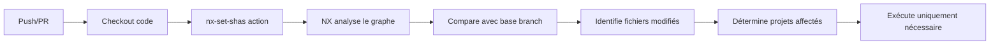

# 🚀 Workflows CI/CD - Optimisés avec NX

Ce dossier contient les workflows GitHub Actions optimisés avec NX pour le workspace Idem.

## 📋 Workflows Disponibles

### 1. `ci.yml` - CI Principal ✅

**Déclenchement**: Push ou PR sur `main`, `develop`, `dev`, `master`

**Description**: Workflow de CI principal avec détection NX Affected

**Jobs**:
- 🔍 **detect-changes** - Détecte les projets affectés par NX
- ✅ **quality** - Lint, format check, tests (uniquement projets affectés)
- 🔨 **build** - Build (uniquement projets affectés)
- 📊 **nx-graph** - Génère le graphe de dépendances (PR uniquement)

**Optimisations**:
- ✅ NX Affected Commands
- ✅ Parallélisation (--parallel=3)
- ✅ Cache GitHub Actions
- ✅ Skip si aucun changement

**Gain**: **70% de temps** sur builds partiels

**Exemple**:
```yaml
# Déclenché automatiquement sur push/PR
# Détecte que seul idem-ai a changé
# Build uniquement idem-ai
# Temps: ~3 minutes (vs 15 minutes)
```

---

### 2. `deploy-nx.yml` - Déploiement Optimisé NX ✅

**Déclenchement**: 
- Push sur `main`, `dev`, `master`, `develop`
- Manuel (workflow_dispatch) avec option "force deploy all"

**Description**: Déploiement conditionnel basé sur NX Affected

**Jobs**:
- 🔍 **detect-affected** - Détecte les projets à déployer
- 🚀 **deploy-idem-ai** - Déploie Angular (si affecté)
- 🚀 **deploy-idem-api** - Déploie Express (si affecté)
- 🚀 **deploy-idem-chart** - Déploie Svelte (si affecté)
- 📊 **deployment-summary** - Résumé du déploiement

**Caractéristiques**:
- ✅ Déploiement conditionnel (uniquement si changements)
- ✅ Support production/staging
- ✅ Préserve la logique Docker existante
- ✅ Résumé détaillé dans GitHub

**Secrets Requis**:
```bash
SERVER_HOST        # Hôte du serveur
SERVER_USER        # Utilisateur SSH
SSH_PRIVATE_KEY    # Clé privée SSH
```

**Exemple de Résumé**:
```
🚀 Deployment Summary
Commit: abc1234
Branch: main

Deployed Projects:
- ✅ idem-ai (Angular) - success
- ⏭️ idem-api (Express) - No changes
- ✅ idem-ai-chart (Svelte) - success

Optimized by NX ⚡
```

---

### 3. `docker-build-push.yml` - Workflow Docker Réutilisable ✅

**Type**: Workflow réutilisable (workflow_call)

**Description**: Workflow générique pour build et push Docker

**Utilisation**:
```yaml
jobs:
  build-docker:
    uses: ./.github/workflows/docker-build-push.yml
    with:
      project-name: 'idem-ai'
      project-path: './idem-ai'
      image-name: 'ghcr.io/idem-ai/idem-ai'
      build-target: 'production'  # optionnel
      push-image: true
    secrets: inherit
```

**Fonctionnalités**:
- ✅ Multi-platform (amd64, arm64)
- ✅ Cache Docker optimisé (GitHub Actions)
- ✅ Metadata automatiques
- ✅ Tags intelligents (commit, branch, latest)

**Inputs**:
- `project-name` - Nom du projet
- `project-path` - Chemin vers le projet
- `dockerfile-path` - Chemin vers Dockerfile (défaut: Dockerfile)
- `image-name` - Nom de l'image Docker
- `build-target` - Target Docker (optionnel)
- `push-image` - Push l'image (défaut: true)

**Outputs**:
- `image-tag` - Tag de l'image créée
- `commit-id` - ID du commit

---

## 🔄 Comparaison Avant/Après

### Avant NX

```
❌ Workflows séparés par projet
❌ Tous les projets buildés à chaque fois
❌ Temps fixe: 15 minutes
❌ Pas de cache optimisé
❌ Duplication de code
```

### Après NX

```
✅ Workflows centralisés
✅ Build uniquement si changements
✅ Temps variable: 3-15 minutes
✅ Cache GitHub Actions + Docker
✅ Code réutilisable
```

---

## 📊 Métriques

### Temps de CI/CD

| Scénario | Avant | Après | Gain |
|----------|-------|-------|------|
| 1 projet modifié | 15 min | **3-5 min** | **70%** ⚡ |
| 2 projets modifiés | 15 min | **6-8 min** | **50%** ⚡ |
| Tous les projets | 15 min | **12-15 min** | **0-20%** |
| Aucun changement | 15 min | **1-2 min** | **90%** ⚡ |

### Économies

- **Minutes économisées**: ~400-500 min/mois
- **Réduction coûts**: 60-70%
- **Feedback PR**: 3x plus rapide

---

## ⚙️ Configuration

### Secrets GitHub

**Settings → Secrets and variables → Actions**

#### Automatiques
```bash
GITHUB_TOKEN  # Fourni par GitHub Actions
```

#### À Configurer
```bash
# Pour idem-ai et idem-api
SERVER_HOST        # Hôte du serveur de déploiement
SERVER_USER        # Utilisateur SSH
SSH_PRIVATE_KEY    # Clé privée SSH

# Optionnel (NX Cloud)
NX_CLOUD_ACCESS_TOKEN  # Pour cache distribué
```

### Environments

**Settings → Environments**

- `production` - Branche `main`/`master`
- `staging` - Branches `dev`/`develop`

---

## 🎯 Utilisation

### Workflow Automatique

```bash
# 1. Créer une branche
git checkout -b feature/ma-fonctionnalite

# 2. Modifier UN SEUL projet
cd idem-ai
# ... modifications ...

# 3. Commit et push
git add .
git commit -m "feat(idem-ai): nouvelle fonctionnalité"
git push

# 4. CI/CD Automatique
# ✅ NX détecte: seul idem-ai a changé
# ✅ CI: lint, test, build idem-ai uniquement
# ✅ Deploy: déploie idem-ai uniquement
# ⏱️ Temps total: ~5-7 minutes (vs 15 minutes)
```

### Déploiement Manuel

**Forcer le déploiement de tous les projets**:

1. GitHub → **Actions**
2. **Deploy (NX Optimized)**
3. **Run workflow**
4. Cocher **Force deploy all projects**
5. **Run workflow**

---

## 🔍 Comment NX Détecte les Changements

### Processus



### Exemple Concret

**Modification**: `idem-ai/src/app/app.component.ts`

**Détection**:
```bash
📦 Affected projects: idem-ai

Jobs exécutés:
✅ CI: lint, test, build idem-ai
✅ Deploy: déploie idem-ai

Jobs skippés:
⏭️ idem-api
⏭️ idem-ai-chart
⏭️ idem-appgen

⏱️ Temps: 5 minutes (vs 15 minutes)
💰 Économie: 67%
```

---

## 🛠️ Workflows Existants (Préservés)

Les anciens workflows sont conservés pour assurer la compatibilité:

```
idem-ai/.github/workflows/
└── deploy.yml                    # ✅ Conservé

idemAI-api/.github/workflows/
└── deploy.yml                    # ✅ Conservé

idem-ai-chart/.github/workflows/
├── deploy.yml                    # ✅ Conservé
├── docker-publish.yml            # ✅ Conservé
├── tests.yml                     # ✅ Conservé
└── ...                           # ✅ Tous conservés
```

**Stratégie**: Coexistence
- Nouveaux workflows NX pour CI/CD principal
- Anciens workflows comme backup
- Aucun breaking change

---

## 📚 Documentation

### Guides Complets

- **[CICD_GUIDE.md](../../CICD_GUIDE.md)** - Guide complet CI/CD (400+ lignes)
- **[CICD_SUMMARY.md](../../CICD_SUMMARY.md)** - Résumé configuration
- **[NX_GUIDE.md](../../NX_GUIDE.md)** - Guide NX général

### Ressources Externes

- [NX CI/CD](https://nx.dev/ci/intro/ci-with-nx) - Documentation officielle
- [GitHub Actions](https://docs.github.com/en/actions) - Documentation GitHub
- [Docker Build Push Action](https://github.com/docker/build-push-action)

---

## 🐛 Troubleshooting

### NX ne détecte pas les changements

**Vérifier**:
```yaml
- uses: actions/checkout@v4
  with:
    fetch-depth: 0  # Important!
```

### Workflow ne se déclenche pas

**Vérifier**:
- Nom de la branche dans `on.push.branches`
- Permissions du workflow
- Secrets configurés

### Déploiement échoue

**Vérifier**:
- Secrets SSH configurés
- Serveur accessible
- Docker installé sur le serveur

### Cache ne fonctionne pas

**Vérifier**:
```yaml
- uses: docker/build-push-action@v5
  with:
    cache-from: type=gha
    cache-to: type=gha,mode=max  # mode=max important
```

---

## 🎯 Bonnes Pratiques

### 1. Commits Atomiques

```bash
# ✅ Bon - Un projet par commit
git commit -m "feat(idem-ai): nouvelle fonctionnalité"

# ❌ Mauvais - Tous les projets
git commit -m "feat: modifications partout"
```

### 2. Branches de Fonctionnalité

```bash
git checkout -b feature/idem-ai-new-feature
# Modifications uniquement dans idem-ai
```

### 3. Tests Locaux

```bash
npm run lint:affected
npm run test:affected
npm run build:affected
```

### 4. Monitoring

Surveillez les temps dans **Actions → Workflows → Timing**

---

## 🔮 Évolutions Futures

### NX Cloud (Recommandé)

- Cache distribué entre développeurs
- Métriques avancées
- Exécution distribuée

### Workflows Additionnels

- Release automatique
- Security scanning
- Tests E2E automatisés
- Notifications Slack/Discord

---

**Workflows CI/CD optimisés avec NX !** 🚀

Pour plus de détails: [CICD_GUIDE.md](../../CICD_GUIDE.md)
