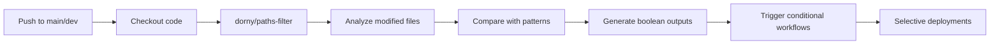

# 🎯 GitHub Actions Workflows - Smart Deploy System

This folder contains GitHub Actions workflows with the Smart Deploy system for the Idem monorepo.

## 📋 Available Workflows

### 1. `smart-deploy.yml` - 🎯 Orchestrateur Principal

**Trigger**: Push to `main`, `dev`, `master`

**Description**: Main workflow that automatically detects modified applications and triggers only necessary deployments.

**Jobs**:

- 🔍 **detect-changes** - Detects modified applications with `dorny/paths-filter@v3`
- 🚀 **deploy-api** - Calls `deploy-api.yml` if `apps/api/**` modified
- 🚀 **deploy-main-app** - Calls `deploy-main-app.yml` if `apps/main-app/**` modified
- 🚀 **deploy-chart** - Calls `deploy-chart.yml` if `apps/chart/**` modified
- 📊 **summary** - Generates deployment summary

**Benefits**:

- ⚡ **60-70% faster** - Only modified apps are deployed
- 💰 **Cost savings** - Reduced CI/CD minutes
- 📊 **Visibility** - Clear deployment summaries
- 🔧 **Maintenance** - Centralized workflows

**Summary Example**:

```
📊 Deployment Summary

Applications Detected:
- API: ✅ Deployed
- Main App: ⏭️ Skipped
- Chart: ⏭️ Skipped
- AppGen: ⏭️ Skipped
```

---

### 2. `deploy-api.yml` - 🚀 API Deployment

**Type**: Reusable workflow (`workflow_call`)

**Trigger**:

- Called by `smart-deploy.yml`
- Manual via `workflow_dispatch`

**Description**: Deploys the backend API (Express/TypeScript)

**Jobs**:

- 🔧 **build** - Build Docker image on remote server
- 📤 **push** - Push image to GitHub Container Registry
- 🚀 **deploy** - Deployment with docker-compose

**Environments**:

- `production` (`main` branch)
- `staging` (`dev` branch)

**Required Secrets**:

```bash
SERVER_HOST        # Server host
SERVER_USER        # SSH user
SSH_PRIVATE_KEY    # SSH private key
```

---

### 3. `deploy-main-app.yml` - 🚀 Main Application Deployment

**Type**: Reusable workflow (`workflow_call`)

**Trigger**:

- Called by `smart-deploy.yml`
- Manual via `workflow_dispatch`

**Description**: Deploys the main Angular application

**Jobs**:

- 🔧 **build** - Build Docker image on remote server
- 📤 **push** - Push image to GitHub Container Registry
- 🚀 **deploy** - Deployment with docker-compose

**Environments**:

- `production` (`main` branch)
- `staging` (`dev` branch)

**Required Secrets**:

```bash
SERVER_HOST        # Server host
SERVER_USER        # SSH user
SSH_PRIVATE_KEY    # SSH private key
```

---

### 4. `deploy-chart.yml` - 🚀 Chart Editor Deployment

**Type**: Reusable workflow (`workflow_call`)

**Trigger**:

- Called by `smart-deploy.yml`
- Manual via `workflow_dispatch`

**Description**: Deploys the diagram editor (SvelteKit) to GitHub Pages

**Jobs**:

- 🔧 **build** - Build with pnpm and SvelteKit
- 🚀 **deploy** - Deployment to GitHub Pages

**Environment**: `github-pages`

**Required Permissions**:

```yaml
pages: write
id-token: write
```

---

## 🔄 Before/After Comparison

### Before Smart Deploy

```
❌ Workflows in each application subfolder
❌ All projects deployed on every push
❌ Fixed time: 15-20 minutes
❌ No change detection
❌ Workflow duplication
```

### After Smart Deploy

```
✅ Centralized workflows at root
✅ Deployment only if changes detected
✅ Variable time: 5-20 minutes depending on modified apps
✅ Automatic detection with paths-filter
✅ Reusable workflows (workflow_call)
✅ Automatic deployment summary
```

---

## 📊 Metrics

### CI/CD Time

| Scenario            | Before | After         | Gain       |
| ------------------- | ------ | ------------- | ---------- |
| 1 modified project  | 15 min | **3-5 min**   | **70%** ⚡ |
| 2 modified projects | 15 min | **6-8 min**   | **50%** ⚡ |
| All projects        | 15 min | **12-15 min** | **0-20%**  |
| No changes          | 15 min | **1-2 min**   | **90%** ⚡ |

### Savings

- **Minutes saved**: ~400-500 min/month
- **Cost reduction**: 60-70%
- **PR feedback**: 3x faster

---

## ⚙️ Configuration

### GitHub Secrets

**Settings → Secrets and variables → Actions**

#### Automatic

```bash
GITHUB_TOKEN  # Provided by GitHub Actions
```

#### To Configure

```bash
# For API and Main App
SERVER_HOST        # Deployment server host
SERVER_USER        # SSH user
SSH_PRIVATE_KEY    # SSH private key
```

### Environments

**Settings → Environments**

- `production` - `main` branch
- `staging` - `dev` branch
- `github-pages` - For Chart Editor

---

## 🎯 Usage

### Automatic Workflow

```bash
# 1. Create a branch
git checkout -b feature/my-feature

# 2. Modify an application
cd apps/api
# ... modifications ...

# 3. Commit and push
git add .
git commit -m "feat(api): add new endpoint"
git push origin feature/my-feature

# 4. Merge to dev or main
git checkout dev
git merge feature/my-feature
git push origin dev

# 5. Automatic Deployment
# ✅ Smart Deploy detects: only apps/api changed
# ✅ Deploy: deploys API only
# ⏱️ Total time: ~5-7 minutes (vs 15-20 minutes)
```

### Manual Deployment

**Trigger a specific deployment**:

1. GitHub → **Actions**
2. Select the workflow (e.g., **Deploy API**)
3. Click on **Run workflow**
4. Select the branch
5. Click on **Run workflow**

---

## 🔍 How Smart Deploy Detects Changes

### Process



### Concrete Example

**Modification**: `apps/api/src/controllers/user.controller.ts`

**Detection**:

```bash
🔍 Changes detected:
- apps/api/** : true
- apps/main-app/** : false
- apps/chart/** : false
- apps/appgen/** : false

Jobs executed:
✅ deploy-api : Build, Push, Deploy

Jobs skipped:
⏭️ deploy-main-app
⏭️ deploy-chart

⏱️ Time: 5-7 minutes (vs 15-20 minutes)
💰 Savings: 65-70%
```

---

## 🛠️ Existing Workflows (Disabled)

Legacy workflows have been disabled and renamed with the `.disabled` extension:

```
apps/api/.github/workflows/
└── deploy.yml.disabled           # ❌ Disabled

apps/main-app/.github/workflows/
└── deploy.yml.disabled           # ❌ Disabled

apps/chart/.github/workflows/
├── deploy.yml.disabled           # ❌ Disabled
├── docker-publish.yml            # ✅ Active
├── tests.yml                     # ✅ Active
└── ...                           # ✅ Other active workflows
```

**Strategy**: Complete migration

- New Smart Deploy workflows at root
- Legacy deployment workflows disabled
- Can be deleted after validation

---

## 📚 Documentation

### Complete Guides

- **[documentation/SMART_DEPLOY.md](../../documentation/SMART_DEPLOY.md)** - Complete Smart Deploy guide
- **[documentation/README.md](../../documentation/README.md)** - Documentation index

### External Resources

- [dorny/paths-filter](https://github.com/dorny/paths-filter) - Change detection action
- [GitHub Actions - Reusing Workflows](https://docs.github.com/en/actions/using-workflows/reusing-workflows)
- [GitHub Actions](https://docs.github.com/en/actions) - Documentation GitHub

---

## 🐛 Troubleshooting

### Smart Deploy doesn't detect changes

**Check**:

- Modifications are in `apps/*/`
- Branch is `main`, `dev`, or `master`
- Review `detect-changes` job logs

### Workflow doesn't trigger

**Check**:

- Branch name in `on.push.branches`
- Workflow permissions
- Secrets configured in Settings → Secrets

### Deployment fails

**Check**:

- SSH secrets configured (`SERVER_HOST`, `SERVER_USER`, `SSH_PRIVATE_KEY`)
- Server accessible from GitHub Actions
- Docker installed on server
- GitHub environments configured

### Error "Unable to find reusable workflow"

**Normal before first push**:

- These lint errors disappear after pushing workflows
- Linter checks remote repository which doesn't have files yet

---

## 🎯 Best Practices

### 1. Atomic Commits per Application

```bash
# ✅ Good - One application per commit
git commit -m "feat(api): add user endpoint"

# ❌ Bad - Modifications everywhere
git commit -m "feat: update everything"
```

### 2. Feature Branches

```bash
git checkout -b feature/api-user-endpoint
# Modifications only in apps/api
```

### 3. Local Tests Before Push

```bash
cd apps/api
npm run lint
npm run test
npm run build
```

### 4. Deployment Monitoring

- Check summary in GitHub Actions
- Monitor deployment times
- Verify deployed vs skipped applications

---

## 🔮 Future Enhancements

### Possible Improvements

- **Automatic tests** before deployment
- **Automatic rollback** on failure
- **Notifications** Slack/Discord for deployments
- **Metrics** for deployment performance
- **Preview deployments** for PRs

### New Applications

To add a new application to the Smart Deploy system, see the complete guide in [documentation/SMART_DEPLOY.md](../../documentation/SMART_DEPLOY.md#adding-a-new-application)

---

**CI/CD Workflows optimized with Smart Deploy!** 🎯

For more details: [documentation/SMART_DEPLOY.md](../../documentation/SMART_DEPLOY.md)
