# Graphe de capacités du moteur vidéo

> Fichier généré par `npm run docs:video-graph` depuis `api/services/Communication/video/video.capabilities.ts`.
> Ne pas éditer à la main. Guide de l'environnement : [VIDEO_ENGINE.md](VIDEO_ENGINE.md).

Le graphe dit ce que la vidéo **peut** utiliser et **quand**. Le routeur (`resolveKit`) le parcourt avec le contexte du projet
(type, objectif, direction de motion, direction artistique, logo vectoriel analysé, médias, format, qualité, secteur, vidéos
précédentes) et rend un kit validé, les addons à charger et le vocabulaire court laissé au modèle.

Score d'un nœud possible = 1 + 1,5 × affinité de direction + type + objectif + DA + secteurs − 0,4 × coût (si coût ≥ 2)
− 1,5 s'il a servi dans les deux dernières vidéos du projet. Tirage déterministe (graine de la vidéo) parmi les nœuds à moins
de 0,75 du meilleur.

## Arêtes « exige »

```mermaid
graph LR
  addon_three["addon:three"]
  lib_three["lib:three"]
  addon_three --> lib_three
  addon_gsap["addon:gsap"]
  lib_gsap["lib:gsap"]
  addon_gsap --> lib_gsap
  addon_anime["addon:anime"]
  lib_anime["lib:anime"]
  addon_anime --> lib_anime
  addon_flubber["addon:flubber"]
  lib_flubber["lib:flubber"]
  addon_flubber --> lib_flubber
  addon_lottie["addon:lottie"]
  lib_lottie["lib:lottie"]
  addon_lottie --> lib_lottie
  addon_rive["addon:rive"]
  lib_rive["lib:rive"]
  addon_rive --> lib_rive
  addon_chart["addon:chart"]
  lib_chartjs["lib:chartjs"]
  addon_chart --> lib_chartjs
  addon_viz["addon:viz"]
  lib_visx["lib:visx"]
  addon_viz --> lib_visx
  addon_draw["addon:draw"]
  lib_draw["lib:draw"]
  addon_draw --> lib_draw
  addon_zdog["addon:zdog"]
  lib_zdog["lib:zdog"]
  addon_zdog --> lib_zdog
  entrance_spring["entrance:spring"]
  lib_motion["lib:motion"]
  entrance_spring --> lib_motion
  logo_trace["logo:trace"]
  logo_trace --> addon_gsap
  logo_morph["logo:morph"]
  logo_morph --> addon_flubber
  logo_extrude["logo:extrude"]
  logo_extrude --> addon_three
  bg_flow_field["bg:flow-field"]
  bg_flow_field --> addon_draw
  bg_sketch_shapes["bg:sketch-shapes"]
  bg_sketch_shapes --> addon_draw
  bg_voronoi["bg:voronoi"]
  bg_voronoi --> addon_viz
  bg_flat3d["bg:flat3d"]
  bg_flat3d --> addon_zdog
  bg_stagger_grid["bg:stagger-grid"]
  bg_stagger_grid --> addon_anime
  annotate_sketch_circle["annotate:sketch-circle"]
  annotate_sketch_circle --> addon_draw
  annotate_brush["annotate:brush"]
  annotate_brush --> addon_draw
  icons_lucide["icons:lucide"]
  lib_lucide["lib:lucide"]
  icons_lucide --> lib_lucide
  icons_tabler["icons:tabler"]
  lib_tabler["lib:tabler"]
  icons_tabler --> lib_tabler
  icons_phosphor_thin["icons:phosphor-thin"]
  lib_phosphor["lib:phosphor"]
  icons_phosphor_thin --> lib_phosphor
  icons_phosphor_light["icons:phosphor-light"]
  icons_phosphor_light --> lib_phosphor
  icons_phosphor_bold["icons:phosphor-bold"]
  icons_phosphor_bold --> lib_phosphor
  icons_phosphor_fill["icons:phosphor-fill"]
  icons_phosphor_fill --> lib_phosphor
  icons_phosphor_duotone["icons:phosphor-duotone"]
  icons_phosphor_duotone --> lib_phosphor
  icons_heroicons_solid["icons:heroicons-solid"]
  lib_heroicons["lib:heroicons"]
  icons_heroicons_solid --> lib_heroicons
  easing_spring["easing:spring"]
  easing_spring --> lib_motion
  postfx_bloom["postfx:bloom"]
  postfx_bloom --> addon_three
  postfx_smaa["postfx:smaa"]
  postfx_smaa --> addon_three
  media_lottie["media:lottie"]
  media_lottie --> addon_lottie
  media_rive["media:rive"]
  media_rive --> addon_rive
  media_model3d["media:model3d"]
  media_model3d --> addon_three
  media_cards3d["media:cards3d"]
  media_cards3d --> addon_three
```

## Bibliothèques installées

| Nœud | Nom | Rôle | Exige | Condition | Convient à | Coût | Rendu | Implémentation |
|---|---|---|---|---|---|---|---|---|
| `lib:react` | React 19 + ReactDOM | Le moteur entier : une image = un rendu synchrone (flushSync) de <Video t={t}/>. | — | — | — | 0 | pure | `video-engine/src/runtime.ts` |
| `lib:tailwind` | Tailwind CSS v4 | Utilitaires compilés au paquet ; palette par défaut retirée, seules les couleurs de la charte existent. | — | — | — | 0 | static | `video-engine/src/tailwind.css` |
| `lib:motion` | Motion (ex-Framer Motion) | Ressorts physiques et interpolation par images clés, fonctions pures du temps (pas animate()). | — | — | — | 0 | pure | `video-engine/src/time.ts` |
| `lib:gsap` | GSAP 3 + DrawSVG, MorphSVG, MotionPath, CustomEase | Timelines en pause posées par seek(t) ; horloge endormie. | — | — | — | 1 | seek | `video-engine/src/addons/gsap.ts` |
| `lib:anime` | anime.js v4 | Timelines autoplay:false posées par seek(ms) ; stagger en grille. | — | — | — | 1 | seek | `video-engine/src/addons/anime.ts` |
| `lib:flubber` | flubber | Morphose de formes SVG (1→1, 1→N, cercle→tracé), fonction pure. | — | — | — | 1 | pure | `video-engine/src/addons/flubber.ts` |
| `lib:three` | three.js + React Three Fiber v9 + drei + postprocessing | Racine R3F frameloop "never", advance(t) par image, horloge posée sur t, lumière Lightformer sans fichier. | — | — | — | 3 | clock-pinned | `video-engine/src/addons/three.tsx` |
| `lib:lottie` | lottie-web (light) | Rendu SVG sans moteur d’expressions (aucun code d’un fichier importé ne s’exécute) ; goToAndStop(trame). | — | — | — | 1 | seek | `video-engine/src/addons/lottie.ts` |
| `lib:rive` | Rive (canvas) | Fichiers .riv importés ; WebAssembly embarqué ; scrub(animation, t). | — | — | — | 2 | seek | `video-engine/src/addons/rive.ts` |
| `lib:chartjs` | Chart.js 4 + datalabels, annotation, treemap, sankey, matrix | Graphiques sur toile : animation coupée, valeurs de l’instant posées puis update("none") (dessin synchrone). | — | — | — | 1 | seek | `video-engine/src/addons/chart.ts` |
| `lib:visx` | visx v4 (composants de data-visualisation) + d3 (interpolate, delaunay, geo) + world-atlas | Composants React en SVG sans animation propre (formes, échelles, dégradés, motifs, courbes, hiérarchies, projections) ; carte du monde en topojson. | — | — | — | 1 | pure | `video-engine/src/addons/viz.ts` |
| `lib:draw` | rough.js + perfect-freehand + simplex-noise | Formes dessinées à la main (graine fixe), traits de pinceau à pression, bruit continu à graine du moteur. | — | — | — | 1 | pure | `video-engine/src/addons/draw.ts` |
| `lib:zdog` | Zdog | Objets en pseudo-3D plats et ronds rendus en SVG ; rotation posée puis updateRenderGraph(), sans boucle. | — | — | — | 1 | pure | `video-engine/src/addons/zdog.ts` |
| `lib:lucide` | Lucide | ~2 100 icônes au trait ; SVG lus côté serveur, jamais embarqués en bloc. | — | — | — | 0 | static | `api/services/Communication/video/video.icons.ts` |
| `lib:tabler` | Tabler Icons | ~5 100 icônes au trait géométrique. | — | — | — | 0 | static | `api/services/Communication/video/video.icons.ts` |
| `lib:phosphor` | Phosphor Icons | ~1 500 icônes × 6 graisses (thin, light, regular, bold, fill, duotone). | — | — | — | 0 | static | `api/services/Communication/video/video.icons.ts` |
| `lib:heroicons` | Heroicons | ~320 icônes pleines et denses. | — | — | — | 0 | static | `api/services/Communication/video/video.icons.ts` |

## Addons du moteur (paquets chargés à la demande)

| Nœud | Nom | Rôle | Exige | Condition | Convient à | Coût | Rendu | Implémentation |
|---|---|---|---|---|---|---|---|---|
| `addon:three` | addon-three.js | Paquet du moteur chargé seulement si un nœud retenu l'exige. | `lib:three` | — | — | 3 | clock-pinned | `public/video-engine/addon-three.js` |
| `addon:gsap` | addon-gsap.js | Paquet du moteur chargé seulement si un nœud retenu l'exige. | `lib:gsap` | — | — | 1 | seek | `public/video-engine/addon-gsap.js` |
| `addon:anime` | addon-anime.js | Paquet du moteur chargé seulement si un nœud retenu l'exige. | `lib:anime` | — | — | 1 | seek | `public/video-engine/addon-anime.js` |
| `addon:flubber` | addon-flubber.js | Paquet du moteur chargé seulement si un nœud retenu l'exige. | `lib:flubber` | — | — | 1 | pure | `public/video-engine/addon-flubber.js` |
| `addon:lottie` | addon-lottie.js | Paquet du moteur chargé seulement si un nœud retenu l'exige. | `lib:lottie` | — | — | 1 | seek | `public/video-engine/addon-lottie.js` |
| `addon:rive` | addon-rive.js | Paquet du moteur chargé seulement si un nœud retenu l'exige. | `lib:rive` | — | — | 2 | seek | `public/video-engine/addon-rive.js` |
| `addon:chart` | addon-chart.js | Paquet du moteur chargé seulement si un nœud retenu l'exige. | `lib:chartjs` | — | — | 1 | seek | `public/video-engine/addon-chart.js` |
| `addon:viz` | addon-viz.js | Paquet du moteur chargé seulement si un nœud retenu l'exige. | `lib:visx` | — | — | 1 | pure | `public/video-engine/addon-viz.js` |
| `addon:draw` | addon-draw.js | Paquet du moteur chargé seulement si un nœud retenu l'exige. | `lib:draw` | — | — | 1 | pure | `public/video-engine/addon-draw.js` |
| `addon:zdog` | addon-zdog.js | Paquet du moteur chargé seulement si un nœud retenu l'exige. | `lib:zdog` | — | — | 1 | pure | `public/video-engine/addon-zdog.js` |

## Concepts narratifs (le modèle en choisit un, parmi les 5 que le graphe propose)

| Nœud | Nom | Rôle | Exige | Condition | Convient à | Coût | Rendu | Implémentation |
|---|---|---|---|---|---|---|---|---|
| `concept:question` | question | ask the audience's own question, then answer it | — | — | dir. editorial 1, swiss 1, precision 1 · types kinetic 1.5, product 1, illustrated 1, mix 1 · obj. announce 1.5, product 1, recruitment 1, testimonial 0.5 | 0 | static | `api/services/Communication/video/video.concepts.ts` |
| `concept:problem-solution` | problem-solution | name an everyday problem, then show it solved | — | — | dir. kinetic 1, brutal 1, swiss 0.5 · types product 1.5, showcase3d 1, kinetic 1, footage 1, mix 1.5 · obj. product 1.5, promotion 1, announce 0.5 | 0 | static | `api/services/Communication/video/video.concepts.ts` |
| `concept:product-hero` | product-hero | reveal the product like a hero, then its strengths | — | — | dir. precision 1, cinematic 1, drenched 1 · types product 2, showcase3d 2.5, promo 1, slideshow 1, mix 1 · obj. product 2.5, promotion 1 | 0 | static | `api/services/Communication/video/video.concepts.ts` |
| `concept:manifesto` | manifesto | short brand beliefs, one after another | — | — | dir. brutal 2, swiss 1, kinetic 1, editorial 0.5 · types kinetic 2.5, mix 1 · obj. announce 1.5, recruitment 1, opening 0.5 · DA maximalism 1, graffiti 1.5, swiss 1 | 0 | static | `api/services/Communication/video/video.concepts.ts` |
| `concept:offer-blast` | offer-blast | hit with the offer, create urgency, then act | — | — | dir. kinetic 1.5, brutal 1.5, drenched 1 · types promo 3, product 0.5, mix 1 · obj. promotion 3 | 0 | static | `api/services/Communication/video/video.concepts.ts` |
| `concept:proof` | proof | lead with proof: a number, a customer's words | — | — | dir. precision 1.5, editorial 1, swiss 1 · types kinetic 1, footage 0.5, mix 1 · obj. testimonial 3, recruitment 1, product 0.5 | 0 | static | `api/services/Communication/video/video.concepts.ts` |
| `concept:journey` | journey | real scenes from the field, with captions | — | — | dir. cinematic 2, editorial 1 · types footage 3, slideshow 1, mix 1 · obj. announce 1, opening 1, recruitment 1 | 0 | static | `api/services/Communication/video/video.concepts.ts` |
| `concept:teaser` | teaser | intrigue first, reveal at the end | — | — | dir. cinematic 1.5, kinetic 1, drenched 1 · types showcase3d 1.5, kinetic 1, product 1, footage 0.5, mix 1.5 · obj. event 1.5, opening 1.5, product 1, announce 1 · DA surreal 1, aurora 1, futuristic 1 | 0 | static | `api/services/Communication/video/video.concepts.ts` |
| `concept:invitation` | invitation | invite: the occasion, the date, the place | — | — | dir. collage 1, editorial 1, kinetic 0.5 · types illustrated 2, kinetic 1, slideshow 0.5, mix 1 · obj. event 3, opening 2.5 | 0 | static | `api/services/Communication/video/video.concepts.ts` |
| `concept:showcase` | showcase | a gallery of the work, then one strong line | — | — | dir. editorial 1.5, collage 1, cinematic 1 · types slideshow 3, product 1, mix 1 · obj. product 1, announce 1, opening 0.5 | 0 | static | `api/services/Communication/video/video.concepts.ts` |
| `concept:reasons` | reasons | why choose us: the reasons, one by one | — | — | dir. swiss 1, precision 1, collage 0.5 · types kinetic 1, product 1, illustrated 1, promo 0.5, mix 1 · obj. recruitment 1.5, product 1, announce 1, promotion 0.5 | 0 | static | `api/services/Communication/video/video.concepts.ts` |
| `concept:celebration` | celebration | celebrate a moment with the community | — | — | dir. collage 2, kinetic 1, drenched 0.5 · types illustrated 2.5, mix 1 · obj. event 1, announce 1, opening 1 · DA pop-art 1, clay 1, y2k 1 | 0 | static | `api/services/Communication/video/video.concepts.ts` |
| `concept:logo-sting` | logo-sting | a short signature: one word, then the logo | — | — | types logo 5 | 0 | static | `api/services/Communication/video/video.concepts.ts` |

## Rythmes (le modèle en choisit un parmi 3 ; jamais celui des dernières vidéos)

| Nœud | Nom | Rôle | Exige | Condition | Convient à | Coût | Rendu | Implémentation |
|---|---|---|---|---|---|---|---|---|
| `rhythm:steady` | Régulier | Chaque scène a son temps de lecture, coupes sur le temps. | — | — | dir. precision 1.5, swiss 1.5, editorial 1 · obj. announce 0.5, recruitment 0.5 | 0 | pure | `api/services/Communication/video/video.rhythm.ts` |
| `rhythm:crescendo` | Crescendo | Ça s’accélère jusqu’au grand moment, puis la signature respire. | — | — | dir. kinetic 2, drenched 1.5, brutal 1, swiss 0.5 · obj. promotion 1, event 1, opening 1 | 0 | pure | `api/services/Communication/video/video.rhythm.ts` |
| `rhythm:staccato` | Staccato | Coupes sèches sur chaque temps, textes brefs. | — | — | dir. brutal 2, kinetic 2, collage 1 · obj. promotion 1.5 | 0 | pure | `api/services/Communication/video/video.rhythm.ts` |
| `rhythm:breathe` | Ample | Longues tenues, entrées lentes, coupes à la mesure. | — | — | dir. cinematic 2.5, editorial 2, precision 1 · obj. testimonial 1, announce 0.5 | 0 | pure | `api/services/Communication/video/video.rhythm.ts` |
| `rhythm:drop` | Montée puis drop | Une montée lente, puis tout s’accélère au grand moment. | — | — | dir. drenched 2, kinetic 1.5, cinematic 1, brutal 1, collage 0.5 · obj. product 1, opening 1 | 0 | pure | `api/services/Communication/video/video.rhythm.ts` |

## Caméras (une par vidéo)

| Nœud | Nom | Rôle | Exige | Condition | Convient à | Coût | Rendu | Implémentation |
|---|---|---|---|---|---|---|---|---|
| `camera:still` | Fixe | Aucun mouvement de caméra : la typographie porte tout. | — | — | dir. swiss 2, brutal 2, collage 1.5 | 0 | pure | `video-engine/src/layout.tsx#useCamera` |
| `camera:push` | Poussée | La caméra avance lentement vers le texte. | — | — | dir. cinematic 2, kinetic 1.5, drenched 1.5 | 0 | pure | `video-engine/src/layout.tsx#useCamera` |
| `camera:pull` | Recul | La caméra recule et se pose. | — | — | dir. precision 1.5, cinematic 1.5, editorial 1 | 0 | pure | `video-engine/src/layout.tsx#useCamera` |
| `camera:drift` | Dérive | Un glissement latéral, dans un sens puis dans l’autre. | — | — | dir. editorial 2, precision 1.5, cinematic 1 | 0 | pure | `video-engine/src/layout.tsx#useCamera` |
| `camera:rise` | Élévation | Le bloc monte doucement pendant la scène. | — | — | dir. drenched 1, kinetic 1, collage 1, editorial 0.5 | 0 | pure | `video-engine/src/layout.tsx#useCamera` |
| `camera:tilt` | Bascule 3D | Légère rotation en perspective, comme un plan tourné. | — | — | dir. kinetic 1.5, precision 1, drenched 1 · DA futuristic 2, glassmorphism 1.5, cyberpunk 1 | 0 | pure | `video-engine/src/layout.tsx#useCamera` |

## Entrées des éléments (une famille par vidéo)

| Nœud | Nom | Rôle | Exige | Condition | Convient à | Coût | Rendu | Implémentation |
|---|---|---|---|---|---|---|---|---|
| `entrance:rise` | Montée | Les éléments montent en fondu. | — | — | dir. editorial 1.5, precision 1.5, cinematic 1.5, swiss 1 | 0 | pure | `video-engine/src/layout.tsx#useEnter` |
| `entrance:spring` | Ressort | Les éléments dépassent leur place puis se posent (ressort physique motion). | `lib:motion` | — | dir. kinetic 2, collage 1.5, drenched 1 | 0 | pure | `video-engine/src/layout.tsx#useEnter` |
| `entrance:flip` | Bascule | Les éléments basculent vers le spectateur (3D). | — | — | dir. swiss 1.5, precision 1.5, kinetic 1, editorial 0.5 | 0 | pure | `video-engine/src/layout.tsx#useEnter` |
| `entrance:unfold` | Dépliage | Les éléments se déplient depuis leur bord haut. | — | — | dir. editorial 1.5, swiss 1.5, brutal 1 | 0 | pure | `video-engine/src/layout.tsx#useEnter` |
| `entrance:skew` | Glissé penché | Les éléments arrivent penchés, puis se redressent. | — | — | dir. brutal 2, kinetic 1, swiss 1 | 0 | pure | `video-engine/src/layout.tsx#useEnter` |
| `entrance:iris` | Iris | Les éléments s’ouvrent depuis leur centre. | — | — | dir. cinematic 1.5, drenched 1.5, precision 1 | 0 | pure | `video-engine/src/layout.tsx#useEnter` |
| `entrance:drop` | Chute | Les éléments tombent et se posent de travers, comme des papiers. | — | — | dir. collage 2, kinetic 1 | 0 | pure | `video-engine/src/layout.tsx#useEnter` |
| `entrance:pop` | Pop | Les éléments jaillissent en tournant légèrement. | — | — | dir. kinetic 1.5, collage 1.5 | 0 | pure | `video-engine/src/layout.tsx#useEnter` |
| `entrance:slideLeft` | Glissé | Les éléments glissent depuis la droite. | — | — | dir. swiss 1.5, brutal 1.5, precision 1 | 0 | pure | `video-engine/src/layout.tsx#useEnter` |

## Mises en scène des plans (une par plan, jamais deux fois de suite)

| Nœud | Nom | Rôle | Exige | Condition | Convient à | Coût | Rendu | Implémentation |
|---|---|---|---|---|---|---|---|---|
| `treatment:split` | Écran partagé | Le clip sur une moitié du cadre, le texte sur l’aplat de la marque, une couture de couleur. | — | — | dir. swiss 2, precision 2, editorial 1, brutal 1 · DA swiss 1.5, minimalism 1 | 0 | pure | `video-engine/src/treatments.tsx#Split` |
| `treatment:window` | Fenêtre | Le clip apparaît dans une forme qui s’ouvre : arche, cercle ou rectangle. | — | — | dir. editorial 2, collage 2, cinematic 1, drenched 1, kinetic 1, precision 1 · DA bohemian 1.5, retro 1, handwritten 1, victorian 1 | 0 | pure | `video-engine/src/treatments.tsx#Window` |
| `treatment:blinds` | Lames | Des lames découvrent le clip ; une bande reste et porte le titre. | — | — | dir. brutal 2, swiss 1.5, kinetic 1.5, drenched 1 · DA maximalism 1, graffiti 1 | 0 | pure | `video-engine/src/treatments.tsx#Blinds` |
| `treatment:magazine` | Page de magazine | Titre en haut, clip encadré au centre, légende en bas, filet décalé. | — | — | dir. editorial 2.5, precision 1.5, swiss 1, collage 1 · DA editorial 2, minimalism 1 | 0 | pure | `video-engine/src/treatments.tsx#Magazine` |
| `treatment:knockout` | Clip dans les lettres | Le clip joue dans les lettres géantes du titre, puis la caméra traverse le texte. | — | — | dir. kinetic 2, brutal 2, drenched 1.5, swiss 1, editorial 0.5 · DA maximalism 1.5, pop-art 1, cyberpunk 1, futuristic 1 | 0 | pure | `video-engine/src/treatments.tsx#Knockout` |
| `treatment:inline` | Clip dans la phrase | Le clip dans une capsule insérée au milieu du titre. | — | — | dir. kinetic 2, collage 2, editorial 1, precision 1 · DA y2k 1.5, clay 1, pop-art 1 | 0 | pure | `video-engine/src/treatments.tsx#Inline` |
| `treatment:duotone` | Bichromie | Le clip aux couleurs de la marque, titre géant au trait. | — | — | dir. drenched 3, kinetic 1, brutal 1 · DA aurora 1, surreal 1, pop-art 1 | 0 | pure | `video-engine/src/treatments.tsx#Duotone` |
| `treatment:broadcast` | Barre de titre | Barre et onglet façon télévision, sur le clip plein cadre. | — | — | dir. precision 2, swiss 1.5 | 0 | pure | `video-engine/src/treatments.tsx#Broadcast` |
| `treatment:cinema` | Cinéma | Sous-titres sur le clip, vignettage de film. | — | — | dir. cinematic 3 | 0 | pure | `video-engine/src/treatments.tsx#Cinema` |

## Grand moment (la scène est choisie par le modèle, l’effet par la direction)

| Nœud | Nom | Rôle | Exige | Condition | Convient à | Coût | Rendu | Implémentation |
|---|---|---|---|---|---|---|---|---|
| `accent:punch` | Coup de poing | Zoom bref et éclair de couleur à l’entrée de la scène, son d’impact. | — | — | dir. brutal 2.5, kinetic 2, collage 1.5 | 0 | pure | `video-engine/src/App.tsx#AccentFlash` |
| `accent:giant` | Titre géant | Le titre de la scène occupe tout le cadre. | — | — | dir. swiss 2, brutal 1.5, drenched 1.5, precision 1, kinetic 1 | 0 | pure | `video-engine/src/scenes.tsx#Headline` |
| `accent:hold` | Temps suspendu | La scène dure plus longtemps et ses entrées ralentissent : on laisse respirer. | — | — | dir. cinematic 2.5, editorial 2, precision 1 | 0 | pure | `video-engine/src/text.tsx#Kinetic` |
| `accent:flip` | Bascule de couleur | La scène prend la couleur qui tranche avec ses voisines. | — | — | dir. drenched 2, swiss 1.5, precision 1, editorial 0.5 | 0 | static | `api/services/Communication/video/video.storyboard.ts` |

## Animations du logo

| Nœud | Nom | Rôle | Exige | Condition | Convient à | Coût | Rendu | Implémentation |
|---|---|---|---|---|---|---|---|---|
| `logo:classic` | Signature de la direction | Fin propre à la direction (mot-symbole géant, filet suisse, carte de papier, éclat…), logo en image. | — | — | dir. brutal 1.5, collage 1.5, kinetic 1, drenched 1 | 0 | pure | `video-engine/src/scenes.tsx#Logo` |
| `logo:draw` | Tracé puis remplissage | Les contours du logo vectoriel se tracent, le remplissage monte ensuite. | — | logo SVG, ≥ 1 forme(s), ≤ 40 formes, sans image matricielle | dir. precision 2, editorial 1.5, swiss 1, cinematic 1 · types logo 1.5 · DA minimalism 1, swiss 1, handwritten 1.5 | 0 | pure | `video-engine/src/kit/LogoMotion.tsx#drawPlan` |
| `logo:trace` | Plume | Une plume parcourt les contours (GSAP DrawSVG + CustomEase « main »), forme après forme. | `addon:gsap` | logo SVG, ≥ 1 forme(s), ≤ 12 formes, sans image matricielle | dir. editorial 2, collage 1.5, precision 1 · DA handwritten 2, bohemian 1.5, retro 1 | 1 | seek | `video-engine/src/kit/LogoMotion.tsx#tracePlan` |
| `logo:morph` | Point → logo | Un point grossit puis se divise et prend la forme exacte de chaque partie du logo (flubber). | `addon:flubber` | logo SVG, ≥ 1 forme(s), ≤ 16 formes, sans image matricielle, sans dégradé | dir. kinetic 2, drenched 1.5, precision 1, cinematic 0.5 · types logo 1.5, illustrated 1 · DA futuristic 1.5, pop-art 1, clay 1 | 1 | pure | `video-engine/src/kit/LogoMotion.tsx#morphPlan` |
| `logo:assemble` | Assemblage | Les formes arrivent de directions différentes et s’emboîtent (ressort si la direction rebondit). | — | logo SVG, ≥ 2 forme(s), ≤ 48 formes | dir. collage 2, kinetic 1.5, brutal 1 · DA maximalism 1, collage-art 2, y2k 1 | 0 | pure | `video-engine/src/kit/LogoMotion.tsx#assemblePlan` |
| `logo:wipe` | Balayage oblique | Une diagonale révèle le logo entier ; accepte tout SVG (texte, image, dégradé). | — | logo SVG | dir. swiss 2, brutal 1.5, cinematic 1, drenched 1 | 0 | pure | `video-engine/src/kit/LogoMotion.tsx#wipePlan` |
| `logo:split` | Symbole puis nom | Le symbole se pose, le nom de la marque glisse de derrière lui. | — | symbole en image | dir. precision 1, swiss 1, editorial 1, cinematic 1 · obj. opening 1, announce 0.5 | 0 | pure | `video-engine/src/scenes.tsx#Logo` |
| `logo:extrude` | Logo extrudé en 3D | Le symbole SVG extrudé, lumière de studio et reflet qui balaie la tranche (R3F). | `addon:three` | logo SVG, sans image matricielle, type logo | dir. precision 1, cinematic 1 · types logo 3 | 3 | clock-pinned | `video-engine/src/addons/three.tsx#LogoRig` |

## Fonds

| Nœud | Nom | Rôle | Exige | Condition | Convient à | Coût | Rendu | Implémentation |
|---|---|---|---|---|---|---|---|---|
| `bg:none` | Aucun fond | La surface seule : le choix par défaut des directions sobres (pas de décor par défaut). | — | — | dir. precision 2, cinematic 2, editorial 1.5, swiss 1, drenched 1, brutal 1, kinetic 0.5, collage 0.5 | 0 | static | — |
| `bg:flow-field` | Lignes de flux | Lignes qui ondulent dans un champ de bruit simplex, aux couleurs de la marque, du côté libre. | `addon:draw` | — | dir. cinematic 1.5, precision 1, drenched 1.5, editorial 0.5 · DA aurora 2, surreal 1.5, futuristic 1, minimalism 0.5 · secteurs water 1.5, eco 1, health 1, internet 1 | 1 | pure | `video-engine/src/kit/Backdrop.tsx#FlowFieldBg` |
| `bg:sketch-shapes` | Formes au crayon | Cercle, carré, trait et arc de la charte tracés à la main (rough.js), l’un après l’autre. | `addon:draw` | — | dir. collage 2, editorial 1.5, kinetic 1 · DA handwritten 2.5, bohemian 1.5, collage-art 1.5, clay 1 · secteurs education 1.5, book 1, family 1, smile 1 | 1 | pure | `video-engine/src/kit/Backdrop.tsx#SketchShapesBg` |
| `bg:voronoi` | Mosaïque | Cellules de Voronoï aux couleurs de la charte qui dérivent lentement (d3-delaunay). | `addon:viz` | — | dir. swiss 1, precision 1, drenched 1.5, kinetic 1 · DA vector-art 2, maximalism 1, futuristic 1, pop-art 0.5 · secteurs chart 1, code 1, design 1 | 1 | pure | `video-engine/src/kit/Backdrop.tsx#VoronoiBg` |
| `bg:flat3d` | Objets 3D plats | Boîte, anneau et sphère en pseudo-3D (Zdog) qui tournent lentement du côté libre, sans WebGL. | `addon:zdog` | — | dir. kinetic 1.5, collage 1, precision 1 · DA clay 2, y2k 1.5, vector-art 1.5, futuristic 1 · secteurs delivery 1.5, rocket 1, store 1, gift 1 | 1 | pure | `video-engine/src/kit/Backdrop.tsx#Flat3DBg` |
| `bg:dot-grid` | Trame de points | Points réguliers révélés depuis le coin libre. | — | — | dir. swiss 2, precision 1.5 · DA minimalism 1, swiss 1.5, futuristic 1 · secteurs code 1, business 1, chart 1 | 0 | pure | `video-engine/src/kit/Backdrop.tsx#DotGrid` |
| `bg:halftone` | Demi-teinte | Trame d’imprimerie qui fleurit dans un coin, dérive lente. | — | — | dir. editorial 1.5, collage 2 · DA retro 2, pop-art 2, collage-art 1 · secteurs fashion 1, music 1, book 1 | 0 | pure | `video-engine/src/kit/Backdrop.tsx#Halftone` |
| `bg:shape-field` | Formes de la marque | Cercles, carrés, anneaux aux couleurs de la charte, groupés du côté libre. | — | — | dir. kinetic 2, collage 1.5 · obj. promotion 1, event 1, opening 1 · DA maximalism 1.5, y2k 1.5, clay 1, pop-art 1 · secteurs family 1, food 0.5, smile 1 | 0 | pure | `video-engine/src/kit/Backdrop.tsx#ShapeField` |
| `bg:stagger-grid` | Vague en grille | Grille de points qui s’allume en vague depuis le centre (anime.js stagger grid). | `addon:anime` | — | dir. kinetic 1.5, drenched 1.5, precision 0.5 · DA futuristic 2, cyberpunk 1.5 · secteurs code 1.5, internet 1, rocket 1 | 1 | seek | `video-engine/src/kit/Backdrop.tsx#StaggerGrid` |
| `bg:marquee` | Bandeau du nom | Le nom de la marque en très grand, au trait, qui défile en fond. | — | — | dir. brutal 2, kinetic 1 · obj. promotion 1, event 1 · DA graffiti 1.5, maximalism 1, cyberpunk 1 | 0 | pure | `video-engine/src/kit/Backdrop.tsx#Marquee` |
| `bg:spotlight` | Halo | Un halo de la couleur d’accent qui glisse lentement. | — | — | dir. cinematic 1, drenched 2 · DA aurora 2, glassmorphism 1 · secteurs beauty 1.5, drink 0.5 | 0 | pure | `video-engine/src/kit/Backdrop.tsx#Spotlight` |
| `bg:ticks` | Graduations | Graduations de règle sur deux bords : mesure, exactitude. | — | — | dir. precision 2, swiss 1 · DA minimalism 1, futuristic 1 · secteurs tools 1.5, chart 1, health 0.5, business 0.5 | 0 | pure | `video-engine/src/kit/Backdrop.tsx#Ticks` |

## Annotations du mot mis en valeur

| Nœud | Nom | Rôle | Exige | Condition | Convient à | Coût | Rendu | Implémentation |
|---|---|---|---|---|---|---|---|---|
| `annotate:none` | Aucune annotation | Le mot mis en valeur change seulement de couleur. | — | — | dir. precision 2, cinematic 2, swiss 1.5, brutal 1, drenched 1, editorial 0.5 | 0 | static | — |
| `annotate:marker` | Surligneur | Un trait de surligneur glisse derrière le mot. | — | — | dir. kinetic 1.5, collage 1, editorial 1 · obj. promotion 1 · DA pop-art 1, y2k 1 | 0 | pure | `video-engine/src/kit/Em.tsx` |
| `annotate:underline` | Soulignement à la main | Un trait de feutre souligne le mot. | — | — | dir. editorial 2, collage 1 · DA handwritten 2, bohemian 1 | 0 | pure | `video-engine/src/kit/Em.tsx` |
| `annotate:sketch-circle` | Cercle au crayon | Le mot est entouré d’un double trait de crayon (rough.js). | `addon:draw` | — | dir. collage 1.5, editorial 1, kinetic 0.5 · obj. promotion 0.5, event 0.5 · DA handwritten 2, collage-art 1, bohemian 1 | 1 | pure | `video-engine/src/kit/Em.tsx` |
| `annotate:brush` | Coup de pinceau | Un coup de pinceau à pression variable passe sous le mot (perfect-freehand). | `addon:draw` | — | dir. editorial 1.5, kinetic 1, collage 1, drenched 0.5 · obj. promotion 0.5 · DA handwritten 1.5, bohemian 1.5, retro 1, aurora 0.5 | 1 | pure | `video-engine/src/kit/Em.tsx` |
| `annotate:circle` | Cercle à la main | Le mot est entouré d’un trait de feutre. | — | — | dir. collage 2, kinetic 1 · obj. promotion 1, event 0.5 · DA handwritten 1.5, collage-art 1.5, retro 1 | 0 | pure | `video-engine/src/kit/Em.tsx` |

## Bibliothèques d'icônes

| Nœud | Nom | Rôle | Exige | Condition | Convient à | Coût | Rendu | Implémentation |
|---|---|---|---|---|---|---|---|---|
| `icons:lucide` | Lucide (trait 1,6) | Trait régulier et net. | `lib:lucide` | — | dir. precision 3, editorial 0.5 · DA minimalism 1 | 0 | static | — |
| `icons:tabler` | Tabler (trait 1,75) | Trait géométrique. | `lib:tabler` | — | dir. swiss 3, precision 1 · DA swiss 1.5 | 0 | static | — |
| `icons:phosphor-thin` | Phosphor Thin | Trait très fin, élégant. | `lib:phosphor` | — | dir. cinematic 3 · DA victorian 1, editorial 1 | 0 | static | — |
| `icons:phosphor-light` | Phosphor Light | Trait léger, éditorial. | `lib:phosphor` | — | dir. editorial 3, cinematic 0.5 | 0 | static | — |
| `icons:phosphor-bold` | Phosphor Bold | Trait épais, affirmé. | `lib:phosphor` | — | dir. brutal 3 · DA graffiti 1 | 0 | static | — |
| `icons:phosphor-fill` | Phosphor Fill | Pictogrammes pleins. | `lib:phosphor` | — | dir. kinetic 3, drenched 1 · DA pop-art 1 | 0 | static | — |
| `icons:phosphor-duotone` | Phosphor Duotone | Deux tons, façon découpage. | `lib:phosphor` | — | dir. collage 3 · DA collage-art 1, clay 1 | 0 | static | — |
| `icons:heroicons-solid` | Heroicons Solid | Plein et dense, lisible sur aplat. | `lib:heroicons` | — | dir. drenched 3 | 0 | static | — |

## Logo pendant la vidéo

| Nœud | Nom | Rôle | Exige | Condition | Convient à | Coût | Rendu | Implémentation |
|---|---|---|---|---|---|---|---|---|
| `brandmark:none` | Pas de logo pendant la vidéo | Le logo n’apparaît qu’à la signature finale. | — | — | dir. brutal 2, cinematic 2, kinetic 1.5, collage 1.5, drenched 1 · types logo 3, kinetic 1 | 0 | static | — |
| `brandmark:corner` | Logo discret en coin | Le logo en monochrome (couleur du texte de la scène), sans conteneur, dans le coin que la composition laisse libre ; masqué sur les plans plein cadre. | — | logo SVG | dir. swiss 2, precision 2, editorial 1.5 · types footage 1.5, slideshow 1, product 1, mix 1 · DA minimalism 1, swiss 1.5, editorial 1 | 0 | pure | `video-engine/src/App.tsx#Brandmark` |

## Courbes

| Nœud | Nom | Rôle | Exige | Condition | Convient à | Coût | Rendu | Implémentation |
|---|---|---|---|---|---|---|---|---|
| `easing:spring` | Ressort physique | Rebond réel (motion spring) au lieu d’une courbe : réservé aux directions qui rebondissent. | `lib:motion` | — | dir. kinetic 3, collage 3 | 0 | pure | — |

## Effets 3D

| Nœud | Nom | Rôle | Exige | Condition | Convient à | Coût | Rendu | Implémentation |
|---|---|---|---|---|---|---|---|---|
| `postfx:bloom` | Bloom 3D | Halo léger sur les reflets de la scène 3D (premium seulement, coût SwiftShader). | `addon:three` | qualité ≥ premium, scène 3D | dir. cinematic 2, precision 1.5, drenched 1 | 2 | clock-pinned | `video-engine/src/addons/three.tsx#Stage` |
| `postfx:smaa` | Anticrénelage SMAA | Bords nets de la 3D (posé avec tout effet 3D). | `addon:three` | qualité ≥ hd, scène 3D | — | 1 | clock-pinned | `video-engine/src/addons/three.tsx#Stage` |

## Médias pilotés

| Nœud | Nom | Rôle | Exige | Condition | Convient à | Coût | Rendu | Implémentation |
|---|---|---|---|---|---|---|---|---|
| `media:lottie` | Animation Lottie | Lottie intégrée (aux couleurs de la marque) ou importée (.json, .lottie). | `addon:lottie` | scène lottie | — | 1 | seek | `video-engine/src/media.tsx#LottieBox` |
| `media:rive` | Animation Rive | Fichier .riv importé, joué image par image. | `addon:rive` | média rive | — | 2 | seek | `video-engine/src/media.tsx#RiveBox` |
| `media:model3d` | Modèle 3D importé | GLB tourné en studio, ombre de contact (R3F + drei). | `addon:three` | média model3d | — | 3 | clock-pinned | `video-engine/src/addons/three.tsx#ModelRig` |
| `media:cards3d` | Photos en cartes 3D | Photos posées en arc, caméra qui tourne (R3F + drei RoundedBox). | `addon:three` | scène 3D, média images | — | 3 | clock-pinned | `video-engine/src/addons/three.tsx#CardsRig` |

## Techniques de texte (générées depuis les directions)

| Nœud | Directions |
|---|---|
| `technique:lineWipe` | editorial, cinematic, precision, drenched |
| `technique:maskUp` | editorial, swiss, brutal, precision, drenched |
| `technique:blurWords` | editorial, swiss, kinetic, cinematic, precision |
| `technique:trackIn` | editorial, swiss, cinematic, precision |
| `technique:rotateX` | editorial, swiss, cinematic, precision |
| `technique:scatter` | editorial, collage |
| `technique:outlineFill` | editorial, cinematic, precision, drenched |
| `technique:slideAlternate` | swiss, brutal, collage, drenched |
| `technique:stackPush` | swiss, brutal, drenched |
| `technique:skewIn` | swiss, brutal |
| `technique:boxReveal` | brutal, collage, drenched |
| `technique:stretch` | brutal, kinetic |
| `technique:zoomWords` | brutal, kinetic, drenched |
| `technique:charCascade` | kinetic, collage |
| `technique:scaleBlur` | kinetic, cinematic |
| `technique:flipChars` | kinetic |
| `technique:scramble` | kinetic |
| `technique:springUp` | kinetic, collage, drenched |
| `technique:wave` | kinetic, collage |
| `technique:typewriter` | collage |

## Transitions (catalogue global : l’agent animateur choisit dans le menu filtré par la direction et la DA)

| Nœud | Rôle | Directions (poids) |
|---|---|---|
| `transition:cut` | Coupe franche, sur le temps. (hard) | brutal 4, swiss 3.5, kinetic 2, precision 3, editorial 2.5, collage 2.5, drenched 2.5, cinematic 2 |
| `transition:flashCut` | Coupe + éclair de la couleur d’accent. (hard) | brutal 4, kinetic 4, drenched 1.5, collage 1 |
| `transition:glitch` | Coupe hachée : tranches décalées, une fraction de seconde. (hard) | brutal 2.5, kinetic 2, drenched 1.5, precision 0.8 |
| `transition:dissolve` | Fondu enchaîné. (soft) | cinematic 4, editorial 4, precision 2.2, drenched 1.2 |
| `transition:zoomBlur` | Sortie en zoom flou, entrée par un léger dézoom. (spatial) | kinetic 2.5, cinematic 2, drenched 2, precision 1.5 |
| `transition:zoomThrough` | On traverse l’image. (spatial) | kinetic 4, cinematic 3, precision 2, drenched 2.5 |
| `transition:whip` | Panoramique filé. (spatial) | kinetic 4, collage 1.5, brutal 1.5, drenched 1 |
| `transition:cube` | Rotation de cube 3D : la scène suivante est la face voisine. (spatial) | precision 2, kinetic 2, drenched 1.5, swiss 1 |
| `transition:push` | La scène suivante pousse la précédente. (graphic) | swiss 4, collage 3.5, brutal 3, kinetic 3, precision 1.5 |
| `transition:slideOver` | La nouvelle scène glisse par-dessus. (graphic) | collage 4, editorial 3.5, precision 3, swiss 1.5 |
| `transition:iris` | Raccord graphique depuis le point focal. (graphic) | precision 4, drenched 4, kinetic 3, cinematic 1.5, editorial 1 |
| `transition:wipe` | Volet net, bord à la couleur d’accent. (graphic) | editorial 3.5, swiss 3.5, drenched 3.5, precision 1.5 |
| `transition:blockStack` | Bandes de couleur qui recouvrent. (graphic) | swiss 3.5, brutal 3.5, collage 3.5, kinetic 1.5 |
| `transition:shapeWipe` | Disque de la marque qui grandit, couvre, puis s’ouvre. (graphic) | drenched 3, precision 2, kinetic 2, collage 1.5, swiss 1.5, editorial 1 |
| `transition:stripes` | Lames obliques aux couleurs de la marque. (graphic) | kinetic 3, collage 2.5, brutal 2, drenched 1.5 |
| `transition:split` | Deux panneaux se referment puis s’écartent. (graphic) | swiss 2.5, editorial 2, precision 2, cinematic 1.5, drenched 1.5 |
| `transition:liquid` | Volet au bord en vague. (soft) | drenched 2.5, collage 2, kinetic 1.5, cinematic 1 |

## Mises en page (archétypes : l’agent directeur artistique en choisit une par scène)

| Nœud | Rôle | Directions (poids) |
|---|---|---|
| `layout:wordStack` | poster type: the headline stacked word by word, huge, alternating solid and outline — scènes : hook, statement, cta. | brutal 3, kinetic 3, swiss 2.5, drenched 2, collage 1.5, editorial 1, precision 1, cinematic 0.8 |
| `layout:marqueeBack` | a giant outlined keyword scrolls behind the headline — scènes : hook, statement, cta. | kinetic 3, brutal 2.5, drenched 2.5, collage 2, swiss 1.5, cinematic 1, precision 1, editorial 0.5 |
| `layout:bigNumber` | the number fills the frame, label in a color block — scènes : stat, offer. | swiss 3, brutal 3, precision 2.5, kinetic 2.5, drenched 2, editorial 2, cinematic 1.5, collage 1.5 |
| `layout:diagonalBand` | a tilted brand-color band crosses the frame with the headline on it — scènes : hook, statement, cta, offer. | kinetic 3, brutal 2.5, collage 2.5, drenched 2, swiss 1 |
| `layout:circleStage` | a big brand circle (photo, number or symbol) with a turning ring, text beside it — scènes : hook, statement, stat, cta, product. | precision 2.5, drenched 2.5, kinetic 2, collage 2, editorial 1.5, swiss 1, cinematic 1 |
| `layout:chartRing` | the percentage as a Chart.js ring that sweeps to its value, the number rolling in its center — scènes : stat. | precision 3, swiss 2.5, drenched 2, editorial 2, kinetic 1.5, cinematic 1 |
| `layout:barCompare` | old price and new price as two Chart.js bars that rise, the saving made visible — scènes : offer. | swiss 2.5, brutal 2.5, kinetic 2, precision 2, collage 1.5, drenched 1.5 |
| `layout:dataArc` | a thick 270° gauge (visx) that fills to the percentage, label under it — scènes : stat. | cinematic 2.5, precision 2, drenched 2.5, editorial 1.5, kinetic 1.5, collage 1 |
| `layout:splitBlock` | the frame split in two color blocks: headline on one, details on the other — scènes : statement, benefits, stat, cta, event. | swiss 3, precision 2.5, editorial 2.5, brutal 2, drenched 1.5, cinematic 1, kinetic 1, collage 1 |
| `layout:layeredCards` | each item on a card, cards stacked with depth, floating — scènes : benefits, event. | collage 3, kinetic 2.5, precision 2, drenched 1.5, editorial 1 |
| `layout:gridCards` | a bento grid: headline cell in brand color, one cell per item, focus moves cell to cell — scènes : benefits, event. | swiss 3, precision 3, brutal 2, editorial 1.5, kinetic 1.5, drenched 1 |
| `layout:checklist` | items checked one by one, check marks drawn, a line connects them — scènes : benefits. | precision 2.5, editorial 2, swiss 2, cinematic 1.5, kinetic 1, drenched 1, brutal 1, collage 1 |
| `layout:quoteBig` | a giant quotation mark behind the testimonial, author with a drawn rule — scènes : quote. | editorial 3, cinematic 2.5, collage 2, precision 2, swiss 1.5, drenched 1.5, brutal 1, kinetic 1 |
| `layout:priceBurst` | the price inside a turning starburst, old price struck — scènes : offer, product. | kinetic 3, collage 3, brutal 2, drenched 1.5 |
| `layout:ticker` | two scrolling news-ticker bands frame the headline — scènes : hook, cta, statement. | kinetic 3, brutal 3, drenched 2, collage 2, swiss 1.5 |
| `layout:spotlightWord` | the sentence small, then its key word huge under a spotlight — scènes : hook, statement. | cinematic 3, drenched 2.5, editorial 2, precision 2, kinetic 1.5, swiss 1 |
| `layout:frameOverlap` | headline on a brand-color block, an offset outline frame behind it — scènes : hook, statement, cta, product. | editorial 2.5, swiss 2, precision 2, collage 2, brutal 1.5, drenched 1.5, kinetic 1 |

## Bibliothèques écartées

| Bibliothèque | Raison |
|---|---|
| react-spring / @react-spring/three | animation physique en temps réel (horloge interne) : une image ne se recalcule pas à un instant t donné. |
| motion animate() / <motion.div> | lecture en temps réel ; seules les fonctions pures de motion (spring, interpolate) sont utilisées. |
| @formkit/auto-animate | anime les changements du DOM au fil du temps : sans objet pour un rendu image par image. |
| Remotion | licence commerciale pour une entreprise ; le moteur maison couvre le besoin avec Puppeteer + ffmpeg. |
| Theatre.js | éditeur de timelines pour un humain ; trop lourd pour un rendu piloté par données. |
| @lottiefiles/dotlottie-web | les .lottie sont décompressés côté serveur (jszip) et joués par lottie-web, sans second moteur WebAssembly. |
| Vivus, Rough Notation, mo.js | tracé, annotations et éclats couverts par le kit (LogoMotion, Em, Backdrop) en fonctions du temps ; mo.js n’est plus maintenu. |
| Magic UI, React Bits, Aceternity, Motion Primitives | collections à copier-coller pensées pour l’interaction (hover, scroll) ; leurs meilleures idées sont réécrites dans le kit en fonctions du temps, aux couleurs de la charte. |
| drei <Float>, <Sparkles>, <Text>, <Environment preset> | Float et Sparkles lisent l’horloge (déterministes ici, mais remplacés par la prop t) ; Text et les presets d’Environment téléchargent des fichiers pendant le rendu. |
| lucide-react, @phosphor-icons/react | tout le jeu d’icônes serait embarqué : le serveur n’injecte que les quelques SVG utilisés. |
| Recharts | rendu en plusieurs passes par son store et ses effets : une image n’est pas garantie en un seul rendu synchrone ; visx couvre les composants de data-visualisation. |
| Nivo, Victory | animations par react-spring ou minuteries (horloge interne). |
| ECharts, ApexCharts | horloge d’animation propre et poids ; Chart.js (animation coupée, valeurs posées à chaque image) couvre le besoin. |
| p5.js, paper.js | boucle de dessin propre et poids ; Zdog, rough.js, perfect-freehand et simplex-noise couvrent le dessin génératif image par image. |
| chartjs-chart-wordcloud, @visx/wordcloud | placement des mots aléatoire : une image changerait d’une lecture à l’autre. |

## Exemples de décisions (marques de test)

### Wax & Co — promo, cinétique, DA maximaliste

Kit : logo `assemble`, fond `shape-field` sur stat-3, hook-1, annotation `marker`, icônes `phosphor-fill`, addons aucun.

  - **logo** → `logo:assemble` (score 4.25 : direction kinetic +2.25, DA maximalism +1)
    - écartés : `logo:extrude` (type promo), `logo:morph` (score 4.00, proche du meilleur : non tiré), `logo:classic` (score 2.50 < 3.50), `logo:draw` (score 1.00 < 3.50), `logo:split` (score 1.00 < 3.50), `logo:trace` (score 1.00 < 3.50)
  - **background** → `bg:shape-field` (score 6.50 : direction kinetic +3, objectif promotion +1, DA maximalism +1.5)
    - écartés : `bg:flat3d` (score 4.75 < 5.75), `bg:marquee` (score 4.50 < 5.75), `bg:voronoi` (score 3.50 < 5.75), `bg:stagger-grid` (score 3.25 < 5.75), `bg:halftone` (score 3.00 < 5.75), `bg:sketch-shapes` (score 2.50 < 5.75)
  - **annotate** → `annotate:marker` (score 4.25 : direction kinetic +2.25, objectif promotion +1)
    - écartés : `annotate:circle` (score 3.50, proche du meilleur : non tiré), `annotate:brush` (score 3.00 < 3.50), `annotate:sketch-circle` (score 2.25 < 3.50), `annotate:none` (score 1.00 < 3.50), `annotate:underline` (score 1.00 < 3.50)
  - **icons** → `icons:phosphor-fill` (score 5.50 : direction kinetic +4.5)
    - écartés : `icons:heroicons-solid` (score 1.00 < 4.75), `icons:lucide` (score 1.00 < 4.75), `icons:phosphor-bold` (score 1.00 < 4.75), `icons:phosphor-duotone` (score 1.00 < 4.75), `icons:phosphor-light` (score 1.00 < 4.75), `icons:phosphor-thin` (score 1.00 < 4.75)
  - **brandmark** → `brandmark:none` (score 3.25 : direction kinetic +2.25)
    - écartés : `brandmark:corner` (score 1.00 < 2.50)
  - **easing** → `easing:spring` (score 1.00 : direction kinetic à rebond)
  - **camera** → `camera:rise` (score 2.50 : direction kinetic +1.5)
    - écartés : `camera:push` (score 3.25, proche du meilleur : non tiré), `camera:tilt` (score 3.25, proche du meilleur : non tiré), `camera:drift` (score 1.00 < 2.50), `camera:pull` (score 1.00 < 2.50), `camera:still` (score 1.00 < 2.50)
  - **entrance** → `entrance:spring` (score 4.00 : direction kinetic +3)
    - écartés : `entrance:pop` (score 3.25, proche du meilleur : non tiré), `entrance:drop` (score 2.50 < 3.25), `entrance:flip` (score 2.50 < 3.25), `entrance:skew` (score 2.50 < 3.25), `entrance:iris` (score 1.00 < 3.25), `entrance:rise` (score 1.00 < 3.25)

### Bissap Délices — produit, éditorial

Kit : logo `trace`, fond `none` sur —, annotation `underline`, icônes `phosphor-light`, addons `gsap`.

  - **logo** → `logo:trace` (score 4.00 : direction editorial +3)
    - écartés : `logo:extrude` (type product), `logo:draw` (score 3.25, proche du meilleur : non tiré), `logo:split` (score 2.50 < 3.25), `logo:assemble` (score 1.00 < 3.25), `logo:classic` (score 1.00 < 3.25), `logo:morph` (score 1.00 < 3.25)
  - **background** → `bg:none` (score 3.25 : direction editorial +2.25)
    - écartés : `bg:halftone` (score 3.25, proche du meilleur : non tiré), `bg:sketch-shapes` (score 3.25, proche du meilleur : non tiré), `bg:flow-field` (score 1.75 < 2.50), `bg:spotlight` (score 1.50 < 2.50), `bg:dot-grid` (score 1.00 < 2.50), `bg:flat3d` (score 1.00 < 2.50)
  - **annotate** → `annotate:underline` (score 4.00 : direction editorial +3)
    - écartés : `annotate:brush` (score 3.25, proche du meilleur : non tiré), `annotate:marker` (score 2.50 < 3.25), `annotate:sketch-circle` (score 2.50 < 3.25), `annotate:none` (score 1.75 < 3.25), `annotate:circle` (score 1.00 < 3.25)
  - **icons** → `icons:phosphor-light` (score 5.50 : direction editorial +4.5)
    - écartés : `icons:lucide` (score 1.75 < 4.75), `icons:heroicons-solid` (score 1.00 < 4.75), `icons:phosphor-bold` (score 1.00 < 4.75), `icons:phosphor-duotone` (score 1.00 < 4.75), `icons:phosphor-fill` (score 1.00 < 4.75), `icons:phosphor-thin` (score 1.00 < 4.75)
  - **brandmark** → `brandmark:corner` (score 4.25 : direction editorial +2.25, type product +1)
    - écartés : `brandmark:none` (score 1.00 < 3.50)
  - **camera** → `camera:drift` (score 4.00 : direction editorial +3)
    - écartés : `camera:pull` (score 2.50 < 3.25), `camera:rise` (score 1.75 < 3.25), `camera:push` (score 1.00 < 3.25), `camera:still` (score 1.00 < 3.25), `camera:tilt` (score 1.00 < 3.25)
  - **entrance** → `entrance:rise` (score 3.25 : direction editorial +2.25)
    - écartés : `entrance:unfold` (score 3.25, proche du meilleur : non tiré), `entrance:flip` (score 1.75 < 2.50), `entrance:drop` (score 1.00 < 2.50), `entrance:iris` (score 1.00 < 2.50), `entrance:pop` (score 1.00 < 2.50), `entrance:skew` (score 1.00 < 2.50)

### Kofi Tech — logo, précision, premium

Kit : logo `draw`, fond `none` sur —, annotation `none`, icônes `lucide`, addons aucun.

  - **logo** → `logo:draw` (score 5.50 : direction precision +3, type logo +1.5)
    - écartés : `logo:extrude` (score 4.30 < 4.75), `logo:morph` (score 4.00 < 4.75), `logo:split` (score 3.00 < 4.75), `logo:trace` (score 2.50 < 4.75), `logo:assemble` (score 1.00 < 4.75), `logo:classic` (score 1.00 < 4.75)
  - **background** → `bg:none` (score 4.00 : direction precision +3)
    - écartés : `bg:dot-grid` (score 4.25, proche du meilleur : non tiré), `bg:ticks` (score 4.00, proche du meilleur : non tiré), `bg:voronoi` (score 3.50, proche du meilleur : non tiré), `bg:stagger-grid` (score 3.25 < 3.50), `bg:flat3d` (score 2.50 < 3.50), `bg:flow-field` (score 2.50 < 3.50)
  - **annotate** → `annotate:none` (score 4.00 : direction precision +3)
    - écartés : `annotate:brush` (score 1.00 < 3.25), `annotate:circle` (score 1.00 < 3.25), `annotate:marker` (score 1.00 < 3.25), `annotate:sketch-circle` (score 1.00 < 3.25), `annotate:underline` (score 1.00 < 3.25)
  - **icons** → `icons:lucide` (score 5.50 : direction precision +4.5)
    - écartés : `icons:tabler` (score 2.50 < 4.75), `icons:heroicons-solid` (score 1.00 < 4.75), `icons:phosphor-bold` (score 1.00 < 4.75), `icons:phosphor-duotone` (score 1.00 < 4.75), `icons:phosphor-fill` (score 1.00 < 4.75), `icons:phosphor-light` (score 1.00 < 4.75)
  - **brandmark** → `brandmark:none` (score 4.00 : type logo +3)
    - écartés : `brandmark:corner` (score 4.00, proche du meilleur : non tiré)
  - **camera** → `camera:tilt` (score 2.50 : direction precision +1.5)
    - écartés : `camera:drift` (score 3.25, proche du meilleur : non tiré), `camera:pull` (score 3.25, proche du meilleur : non tiré), `camera:push` (score 1.00 < 2.50), `camera:rise` (score 1.00 < 2.50), `camera:still` (score 1.00 < 2.50)
  - **entrance** → `entrance:rise` (score 3.25 : direction precision +2.25)
    - écartés : `entrance:flip` (score 3.25, proche du meilleur : non tiré), `entrance:iris` (score 2.50, proche du meilleur : non tiré), `entrance:slideLeft` (score 2.50, proche du meilleur : non tiré), `entrance:drop` (score 1.00 < 2.50), `entrance:pop` (score 1.00 < 2.50), `entrance:skew` (score 1.00 < 2.50)

### Mama Kitchen (sans logo) — événement, collage

Kit : logo `classic`, fond `halftone` sur stat-3, hook-1, annotation `circle`, icônes `phosphor-duotone`, addons aucun.

  - **logo** → `logo:classic` (score 3.25 : direction collage +2.25)
    - écartés : `logo:draw` (pas de logo vectoriel), `logo:trace` (pas de logo vectoriel), `logo:morph` (pas de logo vectoriel), `logo:assemble` (pas de logo vectoriel), `logo:wipe` (pas de logo vectoriel), `logo:split` (pas de symbole en image)
  - **background** → `bg:halftone` (score 4.00 : direction collage +3)
    - écartés : `bg:shape-field` (score 4.75, proche du meilleur : non tiré), `bg:sketch-shapes` (score 4.00, proche du meilleur : non tiré), `bg:flat3d` (score 2.50 < 4.00), `bg:marquee` (score 2.00 < 4.00), `bg:none` (score 1.75 < 4.00), `bg:dot-grid` (score 1.00 < 4.00)
  - **annotate** → `annotate:circle` (score 4.50 : direction collage +3, objectif event +0.5)
    - écartés : `annotate:sketch-circle` (score 3.75, proche du meilleur : non tiré), `annotate:brush` (score 2.50 < 3.75), `annotate:marker` (score 2.50 < 3.75), `annotate:underline` (score 2.50 < 3.75), `annotate:none` (score 1.00 < 3.75)
  - **icons** → `icons:phosphor-duotone` (score 5.50 : direction collage +4.5)
    - écartés : `icons:heroicons-solid` (score 1.00 < 4.75), `icons:lucide` (score 1.00 < 4.75), `icons:phosphor-bold` (score 1.00 < 4.75), `icons:phosphor-fill` (score 1.00 < 4.75), `icons:phosphor-light` (score 1.00 < 4.75), `icons:phosphor-thin` (score 1.00 < 4.75)
  - **brandmark** → `brandmark:none` (score 3.25 : direction collage +2.25)
    - écartés : `brandmark:corner` (pas de logo vectoriel)
  - **easing** → `easing:spring` (score 1.00 : direction collage à rebond)
  - **camera** → `camera:rise` (score 2.50 : direction collage +1.5)
    - écartés : `camera:still` (score 3.25, proche du meilleur : non tiré), `camera:drift` (score 1.00 < 2.50), `camera:pull` (score 1.00 < 2.50), `camera:push` (score 1.00 < 2.50), `camera:tilt` (score 1.00 < 2.50)
  - **entrance** → `entrance:pop` (score 3.25 : direction collage +2.25)
    - écartés : `entrance:drop` (score 4.00, proche du meilleur : non tiré), `entrance:spring` (score 3.25, proche du meilleur : non tiré), `entrance:flip` (score 1.00 < 3.25), `entrance:iris` (score 1.00 < 3.25), `entrance:rise` (score 1.00 < 3.25), `entrance:skew` (score 1.00 < 3.25)
