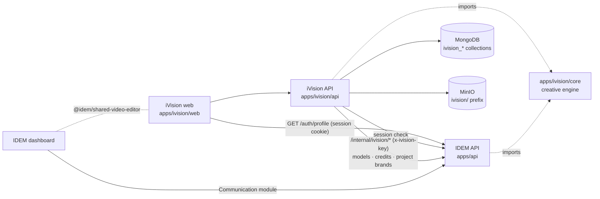

# iVision

iVision is the IDEM service that creates **visuals** and **motion-design videos** through a chat. It
works on its own (its own landing page and studio) and inside IDEM: the dashboard's Communication
module runs the very same engine, and both share the live video editor.

```
apps/ivision/
├── core/   the creative engine shared with the IDEM API (videos, visuals, site scan, model reproduction)
├── api/    iVision back end — Express, port 3006
└── web/    iVision front end — Angular 20, port 4204 (landing + studio)
```

## What a user can do

- **Paste the link of their website.** The site is read (colours by role, fonts, logo, large photos,
  tone of voice, a first art direction); three palettes and three typography pairings are proposed.
  The choice becomes a brand, the same shape as an IDEM brand book (`BrandKit`).
- **Import an IDEM project's brand book** in one click, or enter a brand by hand.
- **Describe what to create**, in one of two separate studios — *Visuels* or *Vidéos* (never mixed in
  one conversation).
- **Answer « do you have a model? »** — asked before every creation. A model video is analysed
  (cuts, shots, motion, transitions, camera, layouts) and its animations are reproduced with the
  user's brand, texts and media; music, sounds, images and texts of the model are never reused. A
  model image gives its layout and structure.
- **Edit the video live**: clicking a text jumps the preview to the moment it is on screen, and every
  keystroke redraws it; photos are replaced in one click; music, sound effects and MP4 export.

## Architecture



### One engine, two hosts

`core/` contains every piece of creative logic: the video service (`src/video`), the React video
engine (`engine/src`), the visual composer (`src/visual`), the website scanner (`src/site`), the
model analyser and its reproduction plan (`src/reference`), the design rules (`src/design`) and the
agent orchestrator (`src/creativity`). It knows nothing about MongoDB, projects or providers: each host
plugs its **ports** with `configureCore()`.

| Port | IDEM API (`apps/api/api/services/ivision/host.ts`) | iVision API (`api/src/core-host.ts`) |
| --- | --- | --- |
| logger | winston `idem-api` | winston `ivision-api` |
| storage | MinIO, project folders | MinIO, `ivision/` prefix |
| vision, image generation | glm-media / Gemini, `AI_CONFIG` | IDEM gateway `ai/vision`, `ai/image` (same models) |
| agent runtime | `runtimeCall` (tiers, escalation, AI usage) | IDEM gateway `ai/agent` (same runtime) |
| credit refund | credit ledger | IDEM gateway `billing/refund` |
| video store | `IdemVideoStore` (projects) | `IvisionVideoStore` (brands) |

Both back ends import the core **by relative path** (no build step, no npm package): a change to the
engine ships to IDEM and to iVision at their next deployment. The IDEM routes and old import paths
are kept through re-export shims (`apps/api/api/services/...` → `apps/ivision/core/src/...`).

### Identity, models and credits come from IDEM

iVision has no sign-in screen, no model provider and no wallet:

- **Identity** — the `httpOnly` `session` cookie set by the IDEM API on `.idem.africa`, checked with
  `GET /auth/profile` (cached 20 s). Not signed in → `{dashboard}/login?redirect=ivision&returnUrl=…`.
- **Gateway** — `apps/api/api/routes/ivision.routes.ts`, mounted at `/internal/ivision`, protected by
  a **dedicated** key (`x-ivision-key` = `IVISION_SERVICE_KEY`, never `INTERNAL_API_KEY`), mounted
  before the per-IP rate limit (all iVision traffic comes from one address; per-user quotas remain).
  It exposes `ai/text`, `ai/agent`, `ai/prompt`, `ai/vision`, `ai/image`, `billing/charge|refund|balance|prices`,
  `projects`, `projects/:id/brand`. Every call is attributed to the user (AI usage tracking).
- **Credits** — the user's IDEM *business* wallet, same prices: iVision computes the cost with the
  shared code (`videoCost`, creativity multiplier, IDEM's price list read from `billing/prices` every
  10 minutes); IDEM debits with the same rules as its own routes (`chargeForService`: enforcement
  mode, 402 with offers, ledger feature `ivision`), only for `motion_video`, `motion_video_rerender`,
  `flyer`, `revision`, bounded to 5 000 credits. A failed creation is refunded.

### The conversation

`api/src/services/chat.service.ts`. A turn always follows the same path, and asks rather than guesses:

1. a link to **another** website than the current brand's → the site is scanned, the brand is
   created (or refreshed, same site) as a draft, the request waits for the palette/typography choice;
2. no brand → ask: paste a site, import an IDEM project, or pick a brand;
3. no model mentioned → ask « do you have a model video / image? » — « no » is an answer;
4. creation: debit, shared engine, real progress streamed (SSE), refund on failure.

The pending request (`session.pending`) is replayed with `{ resume: true }` when the answer arrives,
so choosing a palette or adding a model never means retyping. A video model is refused in the image
studio and vice versa.

### Live editor

`packages/shared-video-editor` (`<idem-video-editor>`), used by iVision web **and** the dashboard's
video detail. The preview page (engine `index.tsx`, `setupEditBridge`) accepts `postMessage` from its
direct parent only: `ivision:edit` (texts/photo of a scene, redrawn and shown at once),
`ivision:focus` (jump to the moment the scene's texts are fully on screen), `ivision:seek|play|pause`;
it sends `ivision:ready` (scenes and their moments) and `ivision:time`. Texts are saved after a typing
pause; the preview is recomposed only when the saved timing changed.

## API (`/v1`, session cookie required except `/sfx`)

| Route | |
| --- | --- |
| `GET /me` | user, IDEM credits |
| `GET/POST /brands`, `GET/PATCH/DELETE /brands/:id` | brands (manual creation, edits) |
| `POST /brands/scan` (SSE) | scan a site outside a conversation |
| `POST /brands/:id/choose` | palette and typography choice → brand ready |
| `POST /brands/import-idem`, `GET /idem/projects` | import an IDEM project's brand book |
| `POST /brands/:id/photos`, `POST /brands/:brandId/media` | brand photos; video media (photos, clips, GLB, Lottie, Rive) |
| `GET/POST /sessions`, `GET/PATCH/DELETE /sessions/:id` | conversations (`mode`: `image` or `video`) |
| `POST /sessions/:id/turn` (SSE) | one turn: `message`, `status`, `progress`, `brand`, `result`, `error`, `done` |
| `POST /references`, `GET /references[/:id]`, `GET /references/:id/sheets/:i` | model upload and analysis (20 per user per day) |
| `GET /videos/options` | slots and limits per scene (same as IDEM) |
| `GET/PATCH/DELETE /brands/:brandId/videos/:id`, `…/preview`, `…/music`, `…/export-quote`, `…/export` | videos |
| `GET /visuals[/:id]`, `DELETE /visuals/:id`, `POST /quote` | visuals, prices |

## Local development

```bash
# Real mode: the IDEM API on :3001 with IVISION_SERVICE_KEY set (same value in apps/ivision/api/.env)
npm run dev:ivision-api          # apps/ivision/api, port 3006
npm run dev:ivision-web          # apps/ivision/web, port 4204

# Offline mode: a simulated IDEM (identity, scripted models, in-memory wallet) and a demo site
npm run dev:ivision-offline      # IDEM :3901, demo site :3902, API :3006 (IVISION_OFFLINE_RESET=1 empties ivision_dev)
SERVICES_API_URL=http://localhost:3901 npm run dev:ivision-web   # then set the cookie session=good on localhost
```

Dependencies are those of the monorepo root (`node_modules` hoisted): nothing to install for local
work. MongoDB and MinIO are the IDEM development ones.

## Checks

| Command | What it proves |
| --- | --- |
| `npm run check --prefix apps/ivision/core` | the engine alone, without IDEM: site scan (palette, fonts, logo, voice), model video analysis (cuts by luminance and by colour), reproduction plan, video reproduced by the service, visual composed and audited |
| `npm run check --prefix apps/ivision/api` | the iVision API end to end with a fake IDEM: delegated identity, brand asked, site scanned, palette chosen, model asked/analysed/reproduced, IDEM prices debited, preview with edit bridge, live text edit, image studio, model kind refused, 402 kept pending, project import, privacy |
| `npm run check:ivision --prefix apps/api` | the IDEM gateway: closed without key, admin key refused, debits bounded, IDEM price list |
| `npm run typecheck:ivision` | core, API and web |

## Configuration

Same mechanism as the IDEM API (`api/src/config/secrets.ts`): locally, `api/.env` (configuration)
then `api/.env.secret` (secrets, never committed) next to it; with `USE_SECRET_MANAGER=true` or
`NODE_ENV=production`, every variable of the Infisical project `ivision-api` is loaded at start-up.
`IVISION_SERVICE_KEY` must hold the same value in `apps/api/.env.secret` (IDEM side, read at the IDEM
API's start-up). `api/.env.example` lists every variable. Secrets (Infisical project `ivision-api`): `MONGODB_PASSWORD`,
`MINIO_ACCESS_KEY`, `MINIO_SECRET_KEY`, `IVISION_SERVICE_KEY` (same value in the `api` project).
Deployment steps: [Deployment › iVision](../../docs/DEPLOYMENT.md#ivision).
