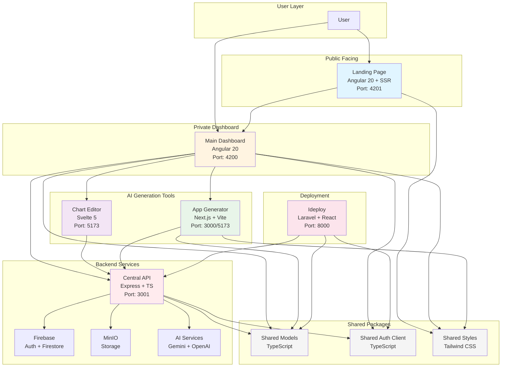

# Idem Project Architecture

## Global Architecture Diagram

## Architecture Overview

The Idem project is a monorepo organized around a central API that coordinates multiple frontend applications and shared packages.

**User Layer:** Users interact with either the public Landing Page or the private Main Dashboard. The Landing Page handles public content and authentication, then redirects users to the Dashboard for their private workspace.

**Frontend Applications:**

- The Main Dashboard is the primary interface for project management, AI generation workflows, and team collaboration
- The Chart Editor provides interactive diagram editing capabilities
- The App Generator creates complete applications using AI

**Backend Services:**

- The Central API acts as the hub, handling authentication, AI generation requests, and data persistence
- Firebase provides authentication and database services
- MinIO handles file storage
- AI Services (Gemini and OpenAI) power the generation capabilities

**Deployment:** Ideploy is a self-hosted deployment platform that can deploy applications created through the system.

**Shared Packages:** Three TypeScript packages provide common functionality across all applications:

- Shared Models: Unified data models
- Shared Auth Client: Authentication client
- Shared Styles: Design system with Tailwind CSS

All frontend applications communicate with the Central API, which in turn interfaces with external services (Firebase, MinIO, AI providers). Shared packages ensure consistency and reduce code duplication across the ecosystem.
