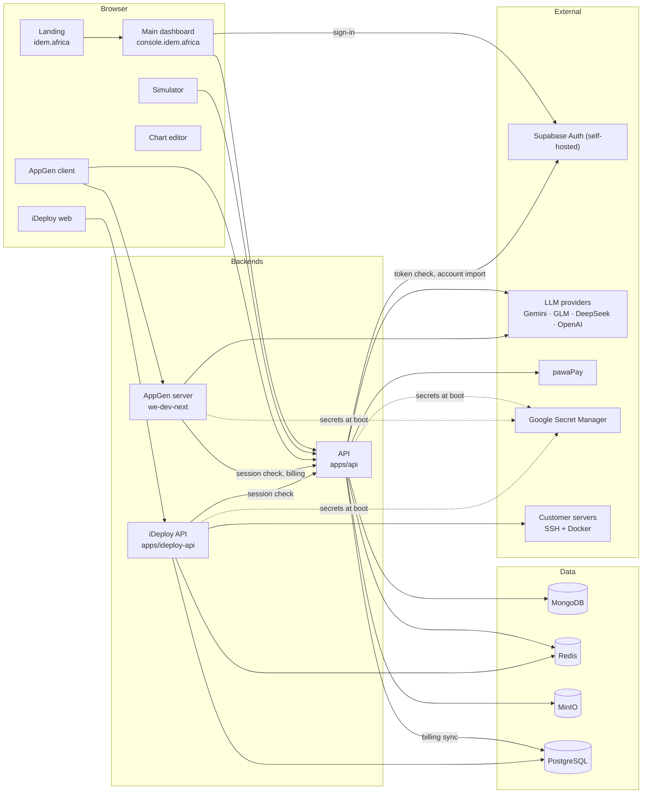

# Architecture

IDEM is a monorepo of six web front ends and three Node.js back ends. One central API owns identity, projects, AI generation and billing; the other back ends delegate authentication to it.

## Applications

| Application | Directory | Stack | Dev port | Role |
| --- | --- | --- | --- | --- |
| Landing | `apps/landing` | Angular 20, SSR (Express), `@angular/localize` FR/EN | 4201 | Public marketing site, pricing, legal pages |
| Main dashboard | `apps/main-dashboard` | Angular 20, Tailwind 4, ngx-translate | 4200 | The console: sign-in, projects, all generation workflows, account and billing |
| Simulator | `apps/simulation` | Angular 22, zoneless, signals | 4203 | Stress-tests a business before launch |
| iDeploy web | `apps/ideploy-web` | Angular 20 | 4202 | UI of the deployment platform |
| AppGen client | `apps/appgen/apps/we-dev-client` | React 18, Vite, WebContainer | 5173 | Generates and runs web applications in the browser |
| Chart editor | `apps/chart` | SvelteKit, Mermaid | 3004 (Docker) | Diagram editor opened from the dashboard |
| API | `apps/api` | Express, TypeScript, Mongoose | 3001 | Identity, projects, AI generation, PDFs, billing and payments |
| AppGen server | `apps/appgen/apps/we-dev-next` | Express 5, Vercel AI SDK | 3000 | LLM chat for AppGen, Netlify deployment |
| iDeploy API | `apps/ideploy-api` | Express, TypeScript, raw SQL, BullMQ | 3002 | Servers, applications, databases, deployments over SSH |

Shared code lives in `packages/` (models, auth client, design system, loader, guided tours, "trusted by" band): see [Packages](PACKAGES.md).

## Data stores

| Store | Used by | Holds |
| --- | --- | --- |
| MongoDB | API | Users, projects and every generated deliverable, revisions, billing ledger, payments, AI usage |
| Redis | API, iDeploy API | API: cache, rate limits, one-time SSO tokens, AppGen hand-offs. iDeploy: BullMQ job queues |
| MinIO (S3) | API | Logos, fonts, PDFs, images; served through `MINIO_PUBLIC_URL` |
| PostgreSQL | iDeploy API, API | iDeploy's schema (inherited from Coolify). The API writes paid plans to `billing_sync_jobs` there |
| PostgreSQL (auth) | Supabase Auth | Sign-in accounts only (e-mail/password, Google, LinkedIn), in `infra/supabase-auth`. Session state is owned by the API |

## Authentication

There is exactly one sign-in screen: the main dashboard.

1. The dashboard signs the user in with the self-hosted Supabase auth server (e-mail and password, Google, LinkedIn), then sends the Supabase access token to `POST /auth/sessionLogin`.
2. The API verifies the token, links it to the IDEM account (the IDEM `uid` never changes, see [Sessions](../apps/api/docs/SESSIONS.md)) and sets two `httpOnly` cookies on `.idem.africa` (`SameSite=Lax`): `session` (14 days) and `refreshToken` (30 days, stored hashed in MongoDB).
3. Every other app sends requests with credentials. Front ends read the identity from `GET /auth/profile`; the AppGen server calls `GET /auth/me`; the iDeploy API calls `/auth/profile` and mirrors the user into its own `users` table.
4. When the session expires, the API renews it from the refresh token, so no app has to send the user back to the login page.

Apps that need a login redirect to `{dashboard}/login?redirect=<app>&returnUrl=…`; the dashboard only follows a `returnUrl` that belongs to a known IDEM app.

## AI generation

The API calls the models, never the browser. Model choice, token budgets and fallback chains live in `apps/api/api/config/ai.config.ts`; routing rules are described in [AI routing](../apps/api/docs/AI_ROUTING.md) and the multi-agent design in [Agent architecture](../apps/api/docs/AGENT_ARCHITECTURE.md). Every model call is recorded in MongoDB (`ai_usage_events`).

Generation is billed in credits per engine (`business`, `appgen`, `ideploy`); payments go through pawaPay (Mobile Money). See [Billing](../apps/api/docs/BILLING.md) and [Payments](../apps/api/docs/PAYMENTS.md).

## Deployments made by iDeploy

The iDeploy API connects to a server over SSH, builds the application (Nixpacks, Dockerfile, static or Docker Compose) and runs it with Docker behind Traefik. Servers are either registered by a team or managed by IDEM and shared between teams, which is why user-supplied values are validated and shell-quoted, and user Compose files are checked against a policy before they run (`apps/ideploy-api/api/docker/compose-policy.ts`).
