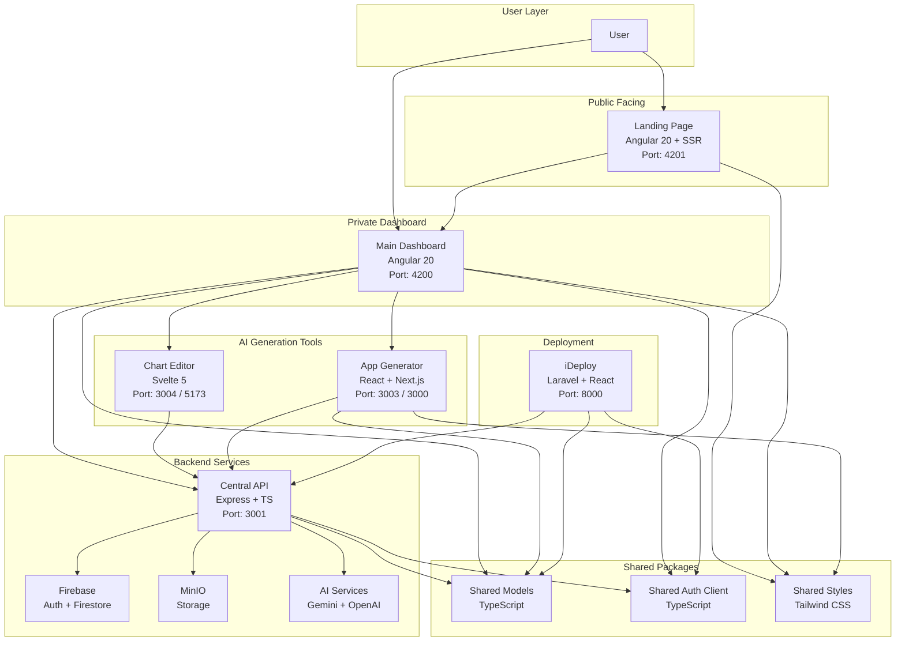

# Global Technical Documentation — Idem Platform

This document describes the global architecture, folder structure, orchestration, and configuration rules for the **Idem** platform monorepo.

---

## 🏛️ Monorepo Architecture

Idem is structured as a monorepo managed with native **npm workspaces** and **pnpm** (for specific modules). It comprises multiple applications that communicate with a central Express API or are orchestrations/deployments of generated code.

### Architecture Map



---

## 📦 Service Registry & Ports

| Application | Directory | Technology | Dev Port | Description |
| :--- | :--- | :--- | :--- | :--- |
| **main-dashboard** | `apps/main-dashboard` | Angular 20 | 4200 | Client-side standalone dashboard for projects and workflows |
| **landing** | `apps/landing` | Angular 20 + SSR | 4201 | Public showcase website and entry point |
| **api** | `apps/api` | Express & TypeScript | 3001 | Central backend database coordinator and AI service interface |
| **chart** | `apps/chart` | Svelte 5 & Mermaid.js | 3004 | Interactive diagram editor and SVG visual exporter |
| **appgen** | `apps/appgen` | React & ExpressJs | 3003 | WebContainer-driven browser editor and compiler |
| **ideploy** | `apps/ideploy` | Laravel & React | 8000 | Self-hosted deployment manager (alternative to Heroku/Vercel) |

---

## 📁 Repository Directory Structure

```
idem/
├── apps/
│   ├── api/                  # Express API Backend
│   ├── appgen/               # React Application Generator (WebContainer)
│   ├── chart/                # Svelte Diagram Editor
│   ├── ideploy/              # PHP & React Deployment Platform
│   ├── landing/              # Angular landing page UI
│   └── main-dashboard/       # Angular main dashboard UI
├── packages/
│   ├── shared-models/        # Common TypeScript interfaces & models
│   ├── shared-auth-client/   # Authentication client utilities
│   └── shared-styles/        # Tailwinds css styles and tokens
├── scripts/
│   ├── setup.sh              # Installation & verification script
│   └── clean.sh              # Workspace cleanup/reset script
├── docker-compose.dev.yml    # Development Docker Compose file
├── package.json              # Monorepo Workspace configuration
├── tsconfig.base.json        # Shared typescript base compiler rules
└── .prettierrc               # Coding standard format definitions
```

---

## 🛠️ Workspace Scripts & Operations

Operations are controlled from the root `package.json` utilizing workspaces syntax:

- **Root Setup**: `./scripts/setup.sh` (Auto-verifies requirements, installs dependencies, compiles packages, sets up `.env` files).
- **Environment Clean**: `./scripts/clean.sh` (Recursively removes `node_modules`, lockfiles, and compiled outputs).
- **Manual Dependency Installation**: `npm install` (installs workspace packages).
- **Build Shared Packages**: `npm run prepare:packages` (generates build folders inside `packages/`).
- **Build All Applications**: `npm run build:all`.

### Command Cheat Sheet

```bash
# Build shared models and auth
npm run prepare:packages

# Individual App Launch
npm run dev:dashboard       # Dashboard (http://localhost:4200)
npm run dev:landing         # Landing page (http://localhost:4201)
npm run dev:api             # Express API (http://localhost:3001)
npm run dev:chart           # Svelte Chart (http://localhost:3004)
npm run dev:appgen-client   # AppGen Client (http://localhost:3000)

# Docker Compose Environment
docker compose -f docker-compose.dev.yml up --build -d  # Start full ecosystem
docker compose -f docker-compose.dev.yml down           # Terminate containers
```

---

## 🤝 Shared Packages Coordination

All applications refer to the local package dependencies inside `packages/` relative to their workspace imports:
1. **`@idem/shared-models`**: Contains structure schema definitions shared by Angular/Express/React (e.g. UML metadata, Business Plan entities).
2. **`@idem/shared-auth-client`**: Contains standard token extraction, JWT authorization, and communication filters.
3. **`@idem/shared-styles`**: Contains global classes, input wrappers, buttons (`inner-button`, `outer-button`), and Tailwind glassmorphic components (`glass`, `glass-card`, `glass-dark`).
