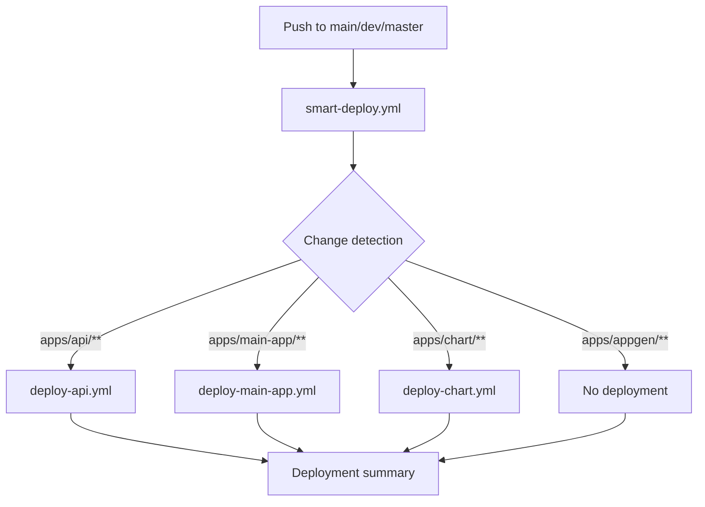

# 🎯 Smart Deploy - Intelligent Deployment System

## Overview

The **Smart Deploy** system automatically detects modified applications in the monorepo and triggers only the necessary deployment pipelines. This saves time and resources by avoiding deployments of unchanged applications.

## Architecture

### Workflow Structure

```
.github/workflows/
├── smart-deploy.yml          # 🎯 Main workflow - Detection and orchestration
├── deploy-api.yml            # 🚀 API deployment
├── deploy-main-app.yml       # 🚀 Main application deployment
└── deploy-chart.yml          # 🚀 Chart Editor deployment
```

### Deployment Flow



## How It Works

### 1. Automatic Change Detection

The `smart-deploy.yml` workflow uses the [`dorny/paths-filter`](https://github.com/dorny/paths-filter) action to detect modified files:

```yaml
- uses: dorny/paths-filter@v3
  id: filter
  with:
    filters: |
      api:
        - 'apps/api/**'
      main-app:
        - 'apps/main-app/**'
      chart:
        - 'apps/chart/**'
      appgen:
        - 'apps/appgen/**'
```

### 2. Conditional Triggering

Each deployment workflow is called only if changes are detected:

```yaml
deploy-api:
  needs: detect-changes
  if: needs.detect-changes.outputs.api == 'true'
  uses: ./.github/workflows/deploy-api.yml
  secrets: inherit
```

### 3. Reusable Workflows

All deployment workflows use `workflow_call` to be reusable:

```yaml
on:
  workflow_call:      # Called by smart-deploy.yml
  workflow_dispatch:  # Manual triggering possible
```

## Supported Applications

| Application | Path | Workflow | Branches | Environments |
|------------|--------|----------|----------|----------------|
| **API** | `apps/api/` | `deploy-api.yml` | `main`, `dev` | Production, Staging |
| **Main App** | `apps/main-app/` | `deploy-main-app.yml` | `main`, `dev` | Production, Staging |
| **Chart** | `apps/chart/` | `deploy-chart.yml` | `master`, `main` | GitHub Pages |
| **AppGen** | `apps/appgen/` | ❌ Not configured | - | - |

## Usage Examples

### Scenario 1: API modification only

```bash
# Modification in apps/api/
git add apps/api/src/controllers/user.controller.ts
git commit -m "feat: add user endpoint"
git push origin dev
```

**Result**: Only the `deploy-api.yml` workflow is executed ✅

### Scenario 2: Multiple application modifications

```bash
# Modifications in api and main-app
git add apps/api/src/ apps/main-app/src/
git commit -m "feat: sync API and frontend"
git push origin dev
```

**Result**: Both `deploy-api.yml` AND `deploy-main-app.yml` workflows are executed ✅

### Scenario 3: Documentation modification only

```bash
# Modification in documentation/
git add documentation/README.md
git commit -m "docs: update README"
git push origin main
```

**Result**: No deployment workflow is executed ⏭️

## Manual Triggering

You can manually trigger a specific deployment via the GitHub Actions interface:

1. Go to **Actions** > Select the workflow (e.g., `Deploy API`)
2. Click on **Run workflow**
3. Select the branch
4. Click on **Run workflow**

## Deployment Summary

At the end of each execution, a summary is automatically generated:

```
📊 Deployment Summary

Applications Detected:
- API: ✅ Deployed
- Main App: ⏭️ Skipped
- Chart: ⏭️ Skipped
- AppGen: ⏭️ Skipped
```

## Secrets Configuration

The following secrets must be configured in GitHub:

### For API and Main App
- `SERVER_HOST`: Deployment server address
- `SERVER_USER`: SSH user
- `SSH_PRIVATE_KEY`: SSH private key for authentication

### For Chart
- No secrets required (GitHub Pages deployment)

## GitHub Environments

The following environments are configured:

- **production**: Triggered on the `main` branch
- **staging**: Triggered on the `dev` branch
- **github-pages**: For Chart Editor deployment

## Benefits

✅ **Time savings**: Only modified applications are deployed  
✅ **Resource savings**: Fewer unnecessary builds and deployments  
✅ **Traceability**: Clear summary of deployed applications  
✅ **Flexibility**: Manual triggering possible for each application  
✅ **Scalability**: Easy to add new applications  

## Adding a New Application

To add a new application to the Smart Deploy system:

### 1. Create the deployment workflow

Create `.github/workflows/deploy-new-app.yml`:

```yaml
name: Deploy New App

on:
  workflow_call:
  workflow_dispatch:

jobs:
  build:
    name: 🔧 Build
    runs-on: ubuntu-latest
    steps:
      - name: Checkout
        uses: actions/checkout@v4
      
      # Add your build steps here
```

### 2. Update smart-deploy.yml

Add detection in the `detect-changes` job:

```yaml
filters: |
  new-app:
    - 'apps/new-app/**'
```

Add the deployment job:

```yaml
deploy-new-app:
  name: 🚀 Deploy New App
  needs: detect-changes
  if: needs.detect-changes.outputs.new-app == 'true'
  uses: ./.github/workflows/deploy-new-app.yml
  secrets: inherit
```

Update the summary:

```yaml
echo "- **New App**: ${{ needs.detect-changes.outputs.new-app == 'true' && '✅ Deployed' || '⏭️ Skipped' }}" >> $GITHUB_STEP_SUMMARY
```

### 3. Test

```bash
git add apps/new-app/
git commit -m "feat: add new app"
git push origin dev
```

## Troubleshooting

### Workflow doesn't trigger

- Verify that modifications are in the correct directory (`apps/*/`)
- Verify that the branch is `main`, `dev`, or `master`
- Check the **Actions** tab to view logs

### A workflow fails

- Check detailed logs in GitHub Actions
- Verify that secrets are correctly configured
- Verify that environments are enabled

### Force a deployment

Use manual triggering via the GitHub Actions interface

## Legacy Workflows

Legacy workflows have been disabled and renamed with the `.disabled` extension:

- `apps/api/.github/workflows/deploy.yml.disabled`
- `apps/main-app/.github/workflows/deploy.yml.disabled`
- `apps/chart/.github/workflows/deploy.yml.disabled`

They can be deleted after validating the new system.

## References

- [GitHub Actions - Reusing Workflows](https://docs.github.com/en/actions/using-workflows/reusing-workflows)
- [dorny/paths-filter](https://github.com/dorny/paths-filter)
- [GitHub Actions - Workflow Syntax](https://docs.github.com/en/actions/using-workflows/workflow-syntax-for-github-actions)
